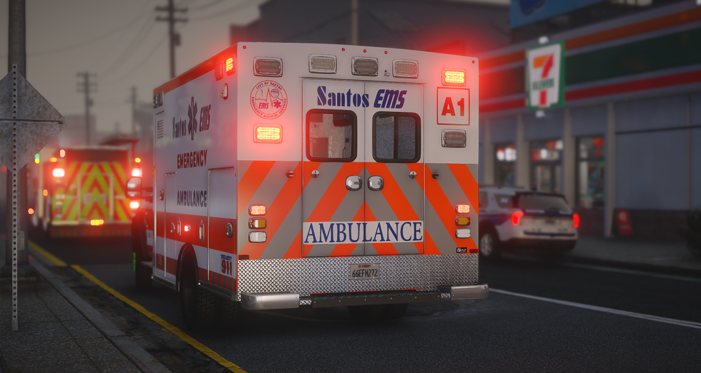
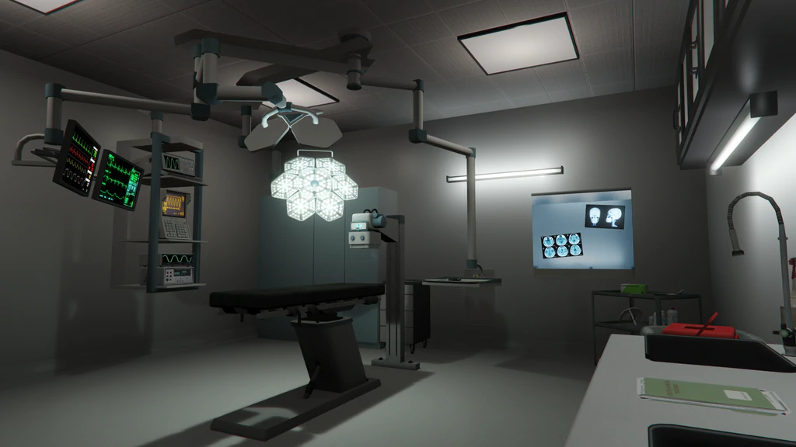

# EMS/Medical Guide

Complete guide to Emergency Medical Services on DPSRP.

*Los Santos Emergency Medical Services - Saving Lives Across San Andreas*

## Overview

DPSRP uses **wasabi_ambulance** - a comprehensive EMS system with immersive medical roleplay, stretcher transport, dispatch integration, and hospital services.

As EMS, you save lives across San Andreas by responding to medical emergencies and treating injured players.

### System Features
- **Medical Bag** - Authentic instruments for roleplay
- **Stretcher System** - Transport patients to ambulance/hospital
- **Built-in Dispatch** - Receive emergency calls
- **Hospital Check-in** - Process patients at facilities
- **Multi-Hospital Support** - Multiple treatment locations
- **Invoice System** - Bill patients for services
- **Anti-Combat Log** - Disconnected players respawn dead

## Getting Started

### Requirements
- Application and interview
- Medical training completion
- Clean background

### Ranks
| Grade | Title | Role |
|-------|-------|------|
| 0 | EMT Basic | Entry level |
| 1 | EMT Advanced | Standard responder |
| 2 | Paramedic | Advanced care |
| 3 | Senior Paramedic | Mentorship |
| 4 | Supervisor | Shift management |
| 5 | Lieutenant | Operations |
| 6 | Captain | Department head |
| 7 | Chief of Medicine | Boss |

## Duty System

### Clocking In
1. Go to Pillbox Medical Center
2. Access duty point: vec3(334.75, -580.24, 43.28)
3. Press **F6** for job menu
4. Select "Go On Duty"

## Controls

| Key | Action |
|-----|--------|
| F6 | Job Menu |
| E | Place Stretcher |
| F1 | Phone (for dispatch) |

## Medical Equipment

### Revival Items
| Item | Use |
|------|-----|
| Defibrillator | Revive downed players |
| Medical Kit | Heal self or others |
| Medical Bag | Full professional equipment |

### Sedatives
| Item | Effect |
|------|--------|
| Sedative | Temporarily incapacitates patient (configurable duration) |

*Used to calm combative patients or for medical procedures*

### Medications
| Drug | Duration | Potency |
|------|----------|---------|
| Morphine 30MG | 120s | Level 9 |
| Morphine 15MG | 50s | Level 5 |
| Percocet 30MG | 60s | Level 6 |
| Percocet 10MG | 45s | Level 4 |
| Percocet 5MG | 30s | Level 2 |
| Vicodin 10MG | 40s | Level 3 |
| Vicodin 5MG | 20s | Level 2 |

### Treatment Items
| Item | Treats |
|------|--------|
| Tweezers | Gunshot wounds |
| Suture Kit | Stab wounds |
| Ice Pack | Blunt trauma |
| Burn Cream | Burns |

## Injury System

### Wound Types
- **Shot** - Gunshot wounds (high bleed)
- **Stabbed** - Knife/blade wounds (high bleed)
- **Beat** - Blunt force trauma
- **Burned** - Fire/explosion damage

### Treatment Times
| Action | Duration |
|--------|----------|
| Diagnose | 7 seconds |
| Treatment | 9 seconds |
| Revive | 12 seconds |

## Death & Revival

### Player Death Stages
1. **Last Stand** - Player can crawl, call for help
2. **Downed** - Immobile, waiting for EMS
3. **Bleedout Timer** - Time limit to be revived
4. **Respawn** - Available after timer expires

### Death Screen
- Synced death animations across all players
- Persistent death state (survives reconnect)
- Anti-combat log protection
- Must receive treatment OR respawn with penalties

### Revival Rewards
| Condition | Payment |
|-----------|---------|
| No injuries | $4,000 |
| Burned | $3,000 |
| Beat injuries | $2,500 |
| Stabbed | $2,000 |
| Bleedout | $2,000 |
| Gunshot | $1,500 |

## Stretcher System

### Using Stretchers
1. Approach downed player
2. Press **E** to deploy stretcher
3. Load patient onto stretcher
4. Transport to ambulance
5. Secure in vehicle
6. Transport to hospital

### Supported Vehicles
- Ambulance (standard)
- 20ramambo
- ec135 (helicopter)

## Vehicles

### Ground Units
| Vehicle | Type |
|---------|------|
| Ambulance | Transport |
| Dodge Charger EMS | Rapid response |

### Air Units
| Vehicle | Type |
|---------|------|
| Maverick | Medical helicopter |

### Spawn Locations
- **Ground:** vec3(296.16, -607.67, 43.25)
- **Air:** vec3(351.24, -587.67, 74.55)

## Hospital Services

*Pillbox Medical Center - Main Reception Area*

### Pillbox Medical Center
- **Location:** vec3(324.15, -583.14, 44.20)
- **Check-in Cost:** $500
- **Check-in Time:** 15 seconds

*State-of-the-art surgical facilities*

### Available Services
- Emergency treatment
- Surgery for serious injuries
- Pharmacy
- 12 hospital beds

## Standard Procedures

### Responding to Calls
1. Accept dispatch call
2. Drive/fly to location (code 3 if emergency)
3. Assess scene safety
4. Approach patient
5. Diagnose injuries
6. Treat wounds
7. Revive if needed
8. Transport to hospital if required

### Triage (Multiple Patients)
1. Assess all patients quickly
2. Prioritize life-threatening injuries
3. Treat most critical first
4. Call for backup if overwhelmed

### Hospital Treatment
1. Bring patient inside
2. Place on hospital bed
3. Administer full treatment
4. Complete medical report
5. Discharge patient

## Mobility Assistance (wasabi_crutch)

EMS and Police can assign mobility aids to injured patients.

### Available Equipment
| Item | Use | Duration |
|------|-----|----------|
| Crutches | Leg injuries, mobility impairment | Up to 10 minutes |
| Wheelchair | Severe injuries, unable to walk | Up to 10 minutes |

### Assigning Mobility Aids
1. Have crutch or wheelchair item
2. Approach injured player
3. Use item on them
4. They receive mobility impairment

### Patient Experience
- **Crutches** - Slower movement, limping animation
- **Wheelchair** - Must use wheelchair to move

### Duration & Removal
- Automatically removed after set time
- Removed on death (configurable)
- EMS can remove early

### Authorized Jobs
Only these jobs can assign mobility aids:
- EMS/Ambulance
- Police

## Tips

1. **Scene Safety** - Ensure area is secure before treating
2. **Communication** - Coordinate with police if scene is dangerous
3. **Prioritize** - Critical patients first
4. **Stock Up** - Keep supplies in your vehicle
5. **Document** - Log treatments for records
6. **Helicopter** - Use for remote/urgent calls
7. **Mobility Aids** - Use crutches/wheelchair for RP immersion
