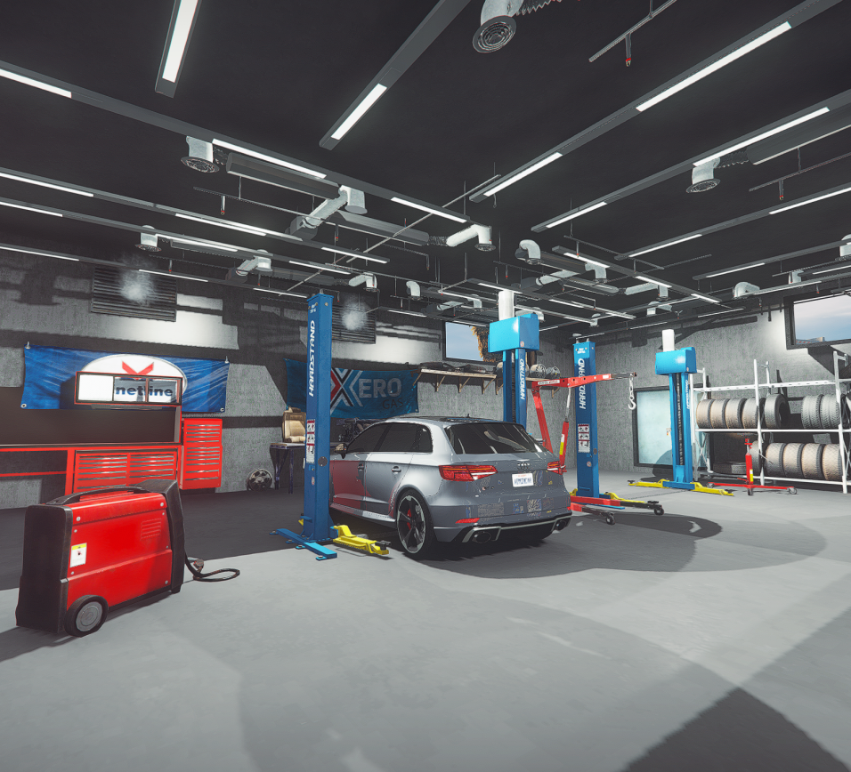
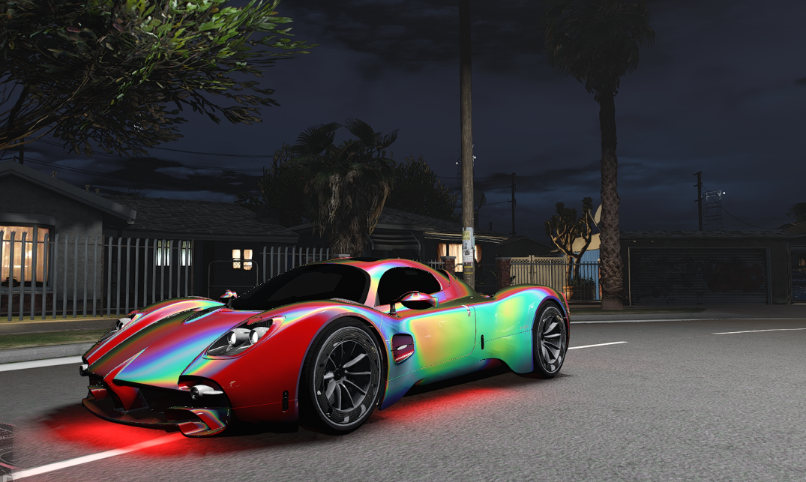
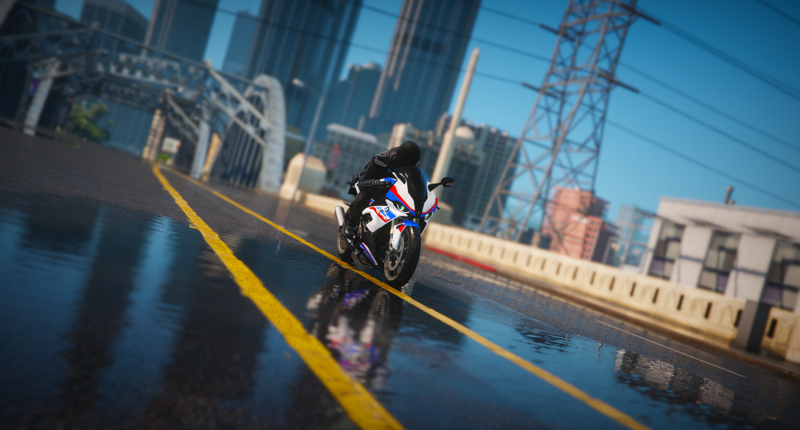

# Mechanic Job Guide

Complete guide to the mechanic profession on DPSRP.

*Los Santos car enthusiasts showing off their builds*

## Overview

Mechanics repair, customize, and tune vehicles using **jg-mechanic**. This is one of the most feature-rich jobs with performance tuning, engine swaps, nitrous installation, and cosmetic modifications.

## Getting Started

### Requirements
- Apply at a mechanic shop
- No special licenses required
- Basic vehicle knowledge helpful

### Mechanic Shops
| Shop | Location | Specialty |
|------|----------|-----------|
| Los Santos Customs | Multiple | General repairs |
| Benny's Original | Strawberry | Custom builds |
| Hayes Autos | Davis | Budget repairs |
| Harmony Repairs | Harmony | Desert service |
| Paleto Customs | Paleto Bay | Northern service |

## Duty System

### Clocking In
1. Go to your assigned shop
2. Access the duty point
3. Press **E** or use job menu
4. You're now on duty

### On-Duty Benefits
- Access to repair equipment
- Can use mechanic tablet
- Earn money from services
- Access shop inventory

## Mechanic Tablet

The tablet is your main tool for all services.

### Accessing
- Press designated key (check settings)
- Or use shop computer

### Available Services
| Service | Description |
|---------|-------------|
| Diagnostics | Check vehicle condition |
| Repairs | Fix damage |
| Tuning | Performance upgrades |
| Cosmetics | Visual modifications |
| Nitrous | Install N2O systems |
| Engine Swaps | Change engine type |

## Repair Services

*Mechanics at work in the shop*

### Damage Types
| Damage | Repair Method |
|--------|---------------|
| Body damage | Body repair kit |
| Engine damage | Engine repair |
| Tire damage | Tire replacement |
| Window damage | Glass repair |

### Repair Process
1. Vehicle enters garage bay
2. Open mechanic tablet
3. Run diagnostics
4. Select repairs needed
5. Charge customer
6. Complete repair

## Performance Tuning

### Available Upgrades
| Category | Options |
|----------|---------|
| Engine | Levels 1-4 |
| Transmission | Levels 1-4 |
| Brakes | Levels 1-4 |
| Suspension | Levels 1-4 |
| Turbo | On/Off |

### Tuning Effects
Each upgrade improves vehicle handling:
- **Engine** - Top speed and acceleration
- **Transmission** - Gear shifting speed
- **Brakes** - Stopping power
- **Suspension** - Handling and stability
- **Turbo** - Additional power boost

## Engine Swaps

Replace a vehicle's engine for different characteristics.

### How It Works
1. Customer brings vehicle
2. Select "Engine Swap" in tablet
3. Choose new engine type
4. Engine swap modifies:
   - Sound (audio hash)
   - Performance (handling values)
   - Character of the vehicle

### Configuration Notes
- Some swaps may affect addon vehicles differently
- Handling values can overwrite or add to existing stats
- Certain swaps restricted to combustion/electric vehicles

## Nitrous Installation

### N2O Systems
| Type | Duration | Power |
|------|----------|-------|
| Basic | Short burst | Moderate |
| Performance | Medium burst | High |
| Racing | Long burst | Maximum |

### Installation
1. Customer requests nitrous
2. Check vehicle compatibility
3. Install appropriate system
4. Explain usage to customer

### Customer Usage
- Activate with designated key
- Limited uses before refill
- Return to mechanic for refills

## Cosmetic Modifications

*A fully customized build fresh out of the shop*

### Available Options
- Paint and pearlescent colors
- Wheel types and colors
- Window tint levels
- Liveries and decals
- Neon underglow
- Headlight colors
- License plate styles

### Process
1. Customer selects modifications
2. Preview changes
3. Apply and charge

## Pricing

Set your own prices or follow shop guidelines:

| Service | Suggested Range |
|---------|-----------------|
| Basic repair | $500 - $2,000 |
| Full repair | $2,000 - $5,000 |
| Tune level 1-2 | $1,000 - $3,000 |
| Tune level 3-4 | $3,000 - $10,000 |
| Engine swap | $10,000 - $50,000 |
| Nitrous | $5,000 - $15,000 |
| Paint job | $500 - $5,000 |

## Shop Management (Boss)

If you're a shop owner/manager:

### Capabilities
- Hire/fire employees
- Set employee ranks
- Manage shop funds
- Set service prices
- Access all shop features

### Boss Menu
1. Be at shop location
2. Have boss grade
3. Open boss menu (F6 or interaction)

*Motorcycle service available*

## Tow Service

Many mechanic shops offer towing:
1. Customer calls for tow
2. Drive tow truck to location
3. Hook up vehicle
4. Transport to shop
5. Begin repairs

## Car Transporter (London Studios)

For transporting multiple vehicles at once, use the car transporter.

### Controls
- Uses NUI menu interface
- Control ramps and loading platforms
- Load/unload vehicles with on-screen buttons

### Capabilities
- Transport multiple vehicles simultaneously
- Adjustable ramps for loading
- Secure vehicles during transport
- Useful for dealership deliveries
- Great for repossessions

### Usage
1. Park transporter on flat surface
2. Open control menu
3. Lower loading ramp
4. Drive vehicle onto transporter
5. Secure vehicle position
6. Raise ramp for transport
7. Reverse process to unload

## Tips

1. **Diagnose first** - Know what you're fixing
2. **Fair pricing** - Build repeat customers
3. **Communicate** - Explain what you're doing
4. **Stay stocked** - Keep repair items ready
5. **Specialize** - Become known for specific work
6. **Network** - Partner with dealerships and racers
7. **Mobile service** - Some repairs can be done roadside
