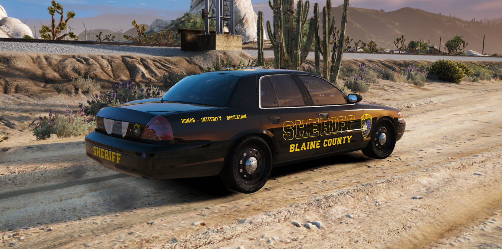
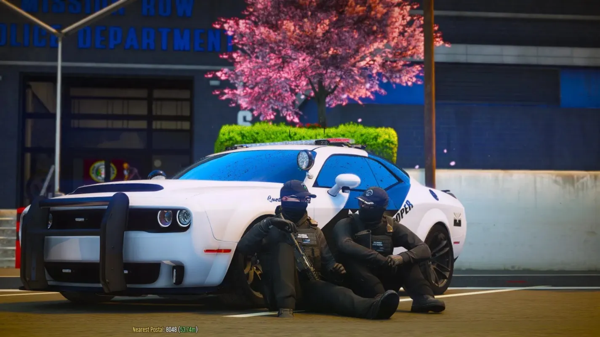

# Police Department Guide

Comprehensive guide to law enforcement on DPSRP.

*Blaine County Sheriff's Office deputies maintaining law and order*

## Departments

| Department | Abbreviation | Jurisdiction |
|------------|--------------|--------------|
| Los Santos Police | LSPD | City of Los Santos |
| Blaine County Sheriff | BCSO | Blaine County |
| State Police | SASP | Statewide |

## Getting Started

### Requirements
- Application and interview
- Background check (clean record preferred)
- Training completion

### Ranks (LSPD Example)
| Grade | Rank | Pay |
|-------|------|-----|
| 0 | Cadet | Base |
| 1 | Officer | +25% |
| 2 | Senior Officer | +35% |
| 3 | Corporal | +45% |
| 4 | Sergeant | +55% |
| 5 | Lieutenant | +70% |
| 6 | Captain | +85% |
| 7 | Assistant Chief | +95% |
| 8 | Chief of Police | Boss |

## Duty System

### Clocking In
1. Go to your department (Mission Row PD for LSPD)
2. Access the duty point
3. Press **F6** to open job menu
4. Select "Go On Duty"

### Duty Location
- **LSPD Mission Row:** vec3(464.87, -977.37, 30.69)

## Controls & Keybinds

| Key | Action |
|-----|--------|
| F6 | Job Menu |
| J | Handcuff/Uncuff |
| G (sprint) | Tackle |
| F9 | Panic Button |
| F11 | Dispatch HUD |
| Z | Focus Dispatch |
| F4 | MDT (if enabled) |

## Tools & Equipment

### Handcuffing
- **J Key** - Cuff/uncuff players
- Hard cuffs and soft cuffs available
- Suspects can attempt escape (skill check)
- Auto-uncuff after 20 minutes
- Lockpicking possible with bobby pins

### Player Interactions
- Search players for items
- Check player ID
- Escort detained players
- Seat/unseat from vehicles
- Grant weapon licenses (Grade 0+)

### Evidence Collection
- GSR (Gunshot Residue) testing
- Blood sample collection
- Bullet casing recovery
- Fingerprint lifting (UV light required)
- Evidence auto-cleans after 5 minutes

### Surveillance
- Tracking bracelets (20-min duration)
- CCTV camera system (14 camera types)
- Speed radar posts

### Scene Management
- Place barriers and cones
- Spike strips
- Police tents and lights
- Vehicle impounding

## London Studios Equipment

### Smart Taser (SmartTaser)
Advanced taser system with realistic mechanics.

**Taser Features:**
- Dual cartridge system (2 shots)
- Laser sight and flashlight
- Drive stun (arc) mode for close range
- Cartridge reactivation
- Safety toggle
- Audit trail logging

**Taser Keybinds:**
| Key | Action |
|-----|--------|
| PageUp | Select left cartridge |
| PageDown | Select right cartridge |
| X | Enable arc/drive stun mode |
| Q | Toggle flashlight |
| E | Toggle laser sight |
| Z | Toggle safety |
| R | Reload taser |

**Taser Commands:**
| Command | Description |
|---------|-------------|
| `/reloadtaser` | Reload taser cartridges |
| `/removebarbs` | Remove barbs from suspect |
| `/toggletorch` | Toggle flashlight |
| `/togglelaser` | Toggle laser sight |
| `/togglesafety` | Toggle safety mode |
| `/drivestun` | Toggle drive stun mode |

**Cartridge System:**
- 2 cartridges loaded
- Requires `taser_cartridge` item to reload
- Can reactivate fired cartridge (re-tase)
- Barbs auto-remove at 25m range

### Directional Spike Strips

Deploy spike strips to stop fleeing vehicles.

**Spike Command:** `/spike create` or `/spike remove`

**Placement Controls:**
| Control | Action |
|---------|--------|
| Mouse | Position spike |
| Grab Key | Grab/move object |
| Rotate Key | Rotate spike direction |
| ALT | Change permanence (temp/perm) |
| Backspace | Cancel placement |
| Enter | Place spike |

**Spike Types:**
- **Temporary** - Removed after use or manually
- **Permanent** - Stays until manually removed

**Effects:**
- Tires pop on contact
- Directional - only affects vehicles crossing the right way
- 5m range to remove

### Weapon Lanyard

Prevents weapons from being lost when disarmed.

**How It Works:**
- Supported weapons attach to lanyard
- If disarmed, weapon falls to lanyard (not ground)
- Automatically re-equip from lanyard
- Works with: Pistol, Combat Pistol, Stungun

**Supported Weapons:**
- WEAPON_PISTOL
- WEAPON_COMBATPISTOL
- WEAPON_STUNGUN (Taser)

### Smart Drone (SmartDrone)

Advanced aerial surveillance drone for police operations.

**Command:** `/drone [type]`

**Drone Types:**
| Type | Model |
|------|-------|
| drone1 | Standard surveillance drone |
| drone2 | Alternate drone model |

**Drone Controls:**
| Key | Action |
|-----|--------|
| Left ALT | Start/stop controlling drone |
| Arrow Up | Rotate camera up |
| Arrow Down | Rotate camera down |
| Arrow Left | Rotate camera left |
| Arrow Right | Rotate camera right |
| F9 | Toggle searchlight |
| Delete | Toggle night vision |
| End | Toggle thermal imaging |
| Page Down | Cycle searchlight color |

**Features:**
- **Night Vision** - See in darkness
- **Thermal Imaging** - Detect heat signatures
- **Searchlight** - Illuminate targets (auto-on 6pm-6am)
  - Multiple colors: White, Blue, Red
- **Maximum Range** - 300m from operator
- **Spawn Pad** - Deploy on landing pad or in front of you

**Searchlight Colors:**
- White (default)
- Blue
- Red

**No-Fly Zones:**
- Military Base (Fort Zancudo) - 400m radius restricted

**Usage Tips:**
1. Find clear area to deploy
2. Use `/drone` command to spawn
3. Press Left ALT to take control
4. Use arrow keys to look around
5. Toggle thermal to find suspects in hiding
6. Maximum 300m range before signal loss
7. Drone removed if you move too far away

### Smart Laser

Speed detection laser gun.

**Features:**
- Point-and-click speed detection
- Accurate readings
- Evidence for traffic stops

## MDT System (Mobile Data Terminal)

### Access
- Command: `/mdt`
- Item: MDT Tablet
- Keybind: F4 (if enabled)

### MDT Features

#### Dispatch
- View active calls
- Respond to incidents
- Create dispatch entries
- Panic button integration

**Dispatch Types:**
- Traffic Stop
- Disturbance
- Theft/Robbery
- Assault
- Shots Fired
- Officer Down

#### Databases
- **Citizens** - Player records, warrants, history
- **Vehicles** - Plate lookup, ownership
- **Weapons** - Registration tracking
- **Properties** - Address information
- **Evidence** - Case evidence management

#### Warrants & BOLOs
- Create/serve warrants
- Issue BOLOs (Be On Lookout)
- Track wanted individuals

#### Charges System
- File charges against citizens
- Set fines and jail time
- Create incident reports

## Vehicles

### Available Units
| Vehicle | Type |
|---------|------|
| Police Cruiser | Patrol |
| Police Cruiser #2 | Patrol |
| Maverick | Helicopter |

### Vehicle Controls
| Key | Action |
|-----|--------|
| Numpad 4 | Toggle Lights |
| Numpad 5 | Cycle Siren |
| Q/E | Spotlight |

## Armoury

### Equipment by Grade
| Grade | Weapons |
|-------|---------|
| 0 | Pistol, Nightstick |
| 1 | Combat Pistol, Nightstick |
| 2+ | Combat Pistol, Nightstick, Assault Rifle |

## Locations

### Mission Row PD
- **Main Entrance:** vec3(464.57, -992.0, 30.69)
- **Armoury:** vec3(480.32, -996.67, 30.69)
- **Evidence Locker:** Inside station
- **Vehicle Garage:** Rear of building

## Jail System

Integration with rcore-prison:
- Process arrests at station
- Set jail time based on charges
- Prisoners transported to Bolingbroke

## Standard Procedures

### Traffic Stop
1. Activate lights behind vehicle
2. Wait for vehicle to pull over
3. Approach safely
4. Request license and registration
5. Run plates through MDT
6. Issue citation or warning

### Arrest Procedure
1. Detain suspect (J key)
2. Read rights
3. Search for contraband
4. Transport to station
5. Process through MDT
6. File charges
7. Set bail/jail time

### Evidence Handling
1. Secure crime scene
2. Photograph evidence
3. Collect samples (GSR, blood, prints)
4. Log in evidence locker
5. Chain of custody documentation

## Tips

1. **Communication** - Use radio for coordination
2. **Documentation** - Log everything in MDT
3. **Backup** - Call for assistance when needed
4. **De-escalation** - Try verbal commands first
5. **Value Life** - Both yours and suspects'
