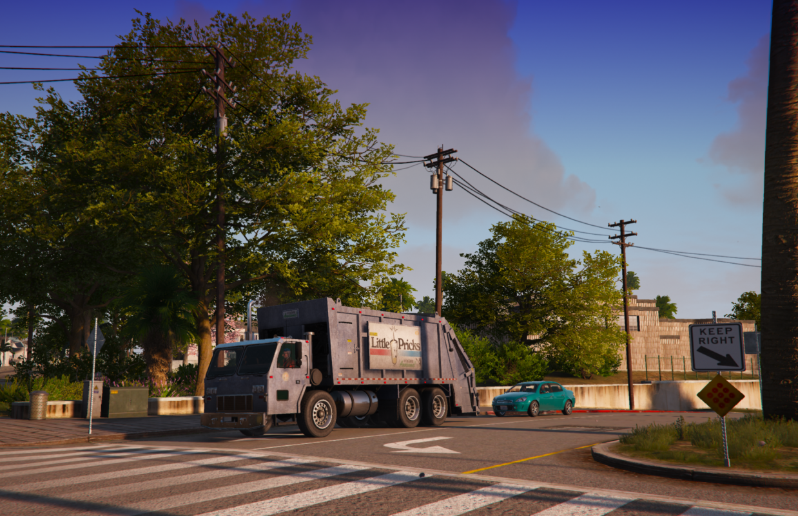

# Trucker Job Guide

Complete guide to the trucking profession on DPSRP.

*Life on the open road - hauling freight across San Andreas*

## Overview

DPSRP uses **lc_truck_logistics** - a comprehensive trucking system inspired by Euro Truck Simulator with skill progression, truck ownership, loans, and multiplayer deliveries.

## Getting Started

### Starting Out
1. Visit the trucking depot
2. Sign up for the job
3. Start with quick jobs using rental trucks
4. Progress to owning your own rig

## Job Types

### Quick Jobs (Rental Trucks)
- Use company trucks
- Lower pay
- No maintenance costs
- Good for beginners

### Freight Jobs (Personal Trucks)
- Use your own truck
- Higher earnings
- Responsible for maintenance
- Requires truck purchase

## Skill Progression

The system features **36 skill levels** that affect your earnings and available jobs.

### Experience System
- Complete deliveries to gain XP
- Higher levels = better paying jobs
- Unlock special cargo types
- Access restricted contracts

### Cargo Certifications
As you level up, unlock certifications for:
| Certification | Cargo Type |
|---------------|------------|
| Basic | Standard goods |
| Fragile | Delicate items |
| Refrigerated | Perishables |
| Flammable | Hazardous materials |
| High-Value | Expensive cargo |
| Oversized | Large loads |

## Truck Ownership

### Buying a Truck
1. Visit the truck dealership
2. Browse available models
3. Purchase or finance
4. Customize your rig

### Truck Types
| Class | Capacity | Speed | Price Range |
|-------|----------|-------|-------------|
| Light | Low | Fast | Budget |
| Medium | Medium | Moderate | Mid-range |
| Heavy | High | Slower | Expensive |
| Custom | Varies | Varies | Premium |

### Maintenance
- Trucks take damage over time
- Repair costs from your pocket
- Regular maintenance recommended
- Breakdowns delay deliveries

## Loan System

Can't afford a truck? Take out a loan!

### How Loans Work
- Borrow funds for truck purchase
- Daily interest fees apply
- Strategic financial planning required
- Pay off early to save on interest

### Loan Tips
- Don't borrow more than needed
- Factor daily fees into earnings
- Pay off quickly when possible

## Deliveries

### Starting a Delivery
1. Accept job at depot or from phone
2. Pick up trailer/cargo
3. Follow GPS to destination
4. Deliver within time limit
5. Get paid!

### Delivery Tips
- Plan your route
- Watch fuel levels
- Avoid accidents (damage = repair costs)
- Longer routes = more money

## Multiplayer/Party System

### Convoy Deliveries
Team up with other truckers:
1. Form a party with friends
2. Accept group contracts
3. Coordinate deliveries
4. Split rewards

### Benefits
- Larger contracts available
- More fun with friends
- Backup if something goes wrong

## Driver Recruitment (Advanced)

### Hiring NPC Drivers
Once established, hire AI drivers:
- Generate passive income
- Drivers work automatically
- Manage your trucking company
- Expand your fleet

### Requirements
- High skill level
- Multiple trucks owned
- Sufficient funds for wages

## Statistics & Leaderboards

### Tracked Stats
- Total deliveries completed
- Miles driven
- Cargo delivered
- Earnings
- Accidents

### Leaderboard
- Compete with other truckers
- Top earners displayed
- Weekly/monthly rankings

## Routes & Regions

### Delivery Zones
| Region | Distance | Pay Multiplier |
|--------|----------|----------------|
| Los Santos | Short | Base |
| Blaine County | Medium | 1.5x |
| Paleto Bay | Long | 2x |
| Sandy Shores | Medium | 1.3x |

### Route Planning
- Farther = more money
- Consider fuel costs
- Watch for dangerous areas
- Time vs money trade-off

## Economy Tips

### Maximizing Profits
1. **Level up fast** - More XP = better jobs
2. **Own your truck** - Better margins than rentals
3. **Maintain regularly** - Prevent costly breakdowns
4. **Take long routes** - Higher pay per trip
5. **Use loans wisely** - Don't overextend
6. **Form convoys** - Group bonuses

### Daily Routine
1. Check available contracts
2. Plan efficient routes
3. Complete deliveries
4. Maintain your truck
5. Track expenses vs income

## Controls

| Key | Action |
|-----|--------|
| E | Enter/Exit vehicle |
| G | Attach/Detach trailer |
| F | Toggle flashers |
| H | Horn |

## Tips for Success

1. **Start small** - Learn with quick jobs
2. **Save for your truck** - Ownership pays off
3. **Get certified** - Special cargo = special pay
4. **Watch your rep** - Failed deliveries hurt
5. **Join a crew** - Convoy work is lucrative
6. **Track expenses** - Know your profit margin
7. **Upgrade wisely** - Better truck = better jobs
