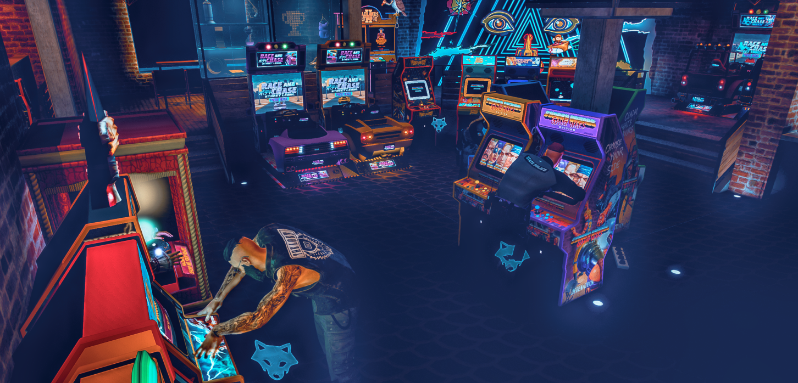
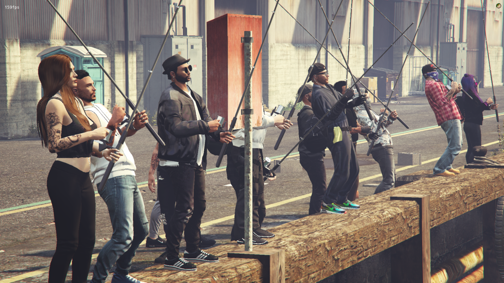
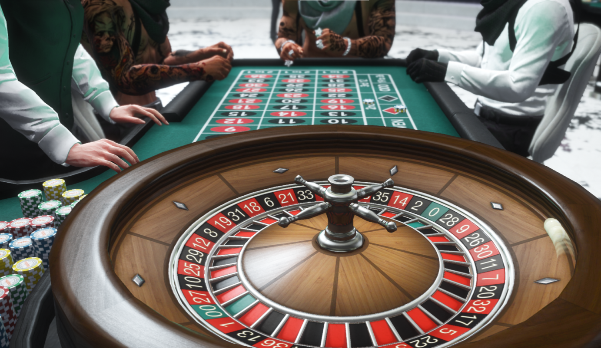
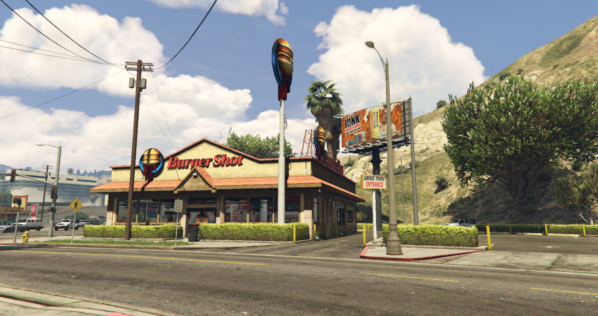

# Activities & Entertainment

Los Santos offers plenty of ways to have fun beyond work.

*The arcade - classic games and good times*

## RCore Activities

### Arcade Games
**Location:** Various arcade locations
- Classic arcade cabinets
- Skill-based games
- High score competitions

### Bowling
**Location:** Bowling alleys
- Full bowling experience
- Multiplayer lanes
- League competitions

### Pool/Billiards
**Location:** Bars and pool halls
- 8-ball gameplay
- Betting available
- Multiple tables

### Darts
**Location:** Bars
- Classic dart games
- 501 and Cricket modes
- Challenge other players

### Golf
**Location:** Los Santos Golf Club
- Full 18-hole course
- Club membership
- Tournaments

### Basketball
**Location:** Courts around the city
- Pickup games
- 1v1 and team play

### Tennis
**Location:** Tennis courts
- Singles and doubles
- Ranked matches

### Drag Racing
**Location:** Various strips
- Organized races
- Betting system
- Custom vehicles

## Beach & Park Activities

### Mirror Park
**Location:** East Los Santos (near the lake)
- **Jetski Rental** - Rent a jetski for water fun ($500 deposit)
- **Yoga Sessions** - Reduce stress on yoga mats
- **Campfire Area** - Warm up and restore health
- **Live Music** - Play guitar or use the boombox
- **Water Dispensers** - Stay hydrated around the park
- **Food Stands** - Sandwiches, coffee, and fresh fruit

### Vespucci Beach
**Location:** West Los Santos beachfront
- **Jetski Rental** - Hit the waves ($500 deposit)
- **Bike Rental** - Explore the boardwalk on two wheels
- **Yoga on the Beach** - Morning yoga sessions
- **Beach Campfire** - Relax by the fire at night
- **Food Stands** - Beachside snacks and drinks

### Surfboarding
**Location:** Vespucci Beach, other coastal areas
- Grab a surfboard and hit the waves
- Ride the swells along the coast
- Show off your skills to beachgoers

## Outdoor Activities

*Relaxing by the water with a fishing rod*

### Camping
- Set up camp anywhere
- Campfires and cooking
- Fishing spots nearby
- Nature exploration

### Fishing
**Location:** Piers, lakes, ocean
- Multiple fish species
- Sell your catch
- Fishing competitions

### Hunting
**Location:** Blaine County wilderness
- Various game animals
- Sell pelts and meat
- Tracking skills

## Entertainment Venues

*Try your luck at the Diamond Casino*

### Diamond Casino
**Location:** Vinewood
- Slot machines
- Table games (Blackjack, Poker, Roulette)
- VIP areas
- Casino missions

### Carnival
**Location:** Del Perro Pier area
- Midway games
- Prize redemption
- Rides and attractions

### Luna Park
**Location:** Amusement park
- Roller coasters
- Carnival games
- Food vendors

## Social Activities

*Party the night away at Bahama Mamas*

### Bars & Clubs
- Live DJ events
- Dance floors
- VIP bottle service
- Karaoke nights

*Or keep it lowkey at the local biker bar*

### Restaurants

*Grab a bite at Burger Shot*

- Sit-down dining
- Date night spots
- Group gatherings

*Or hit up Up-n-Atom for some fast food*

## Sports & Racing

### Drag Racing
- Legal racing events
- Underground meets
- Prize pools

### RC Racing
- Miniature car racing
- Track competitions

## Unique Experiences

### Spray Tags/Graffiti
- Street art locations
- Territory marking
- Crew tags

### Tattoo Parlors
- Custom ink
- Cover-ups
- Special designs

### Roller Skating
- Skate around the city
- Tricks and stunts

## Finding Activities

1. **Blips on map** - Look for activity icons
2. **Phone apps** - Event listings
3. **Word of mouth** - Ask other players
4. **Exploration** - Discover hidden gems

## Tips

- Many activities are better with friends
- Some have daily/weekly rewards
- High scores can earn prizes
- Events are announced in Discord
