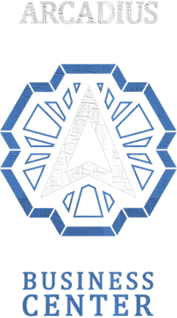

# Business Ownership Guide



*From employee to empire builder - the entrepreneurial path*

---

## The Dream of Ownership

> *You stand in the empty storefront, keys in hand. YOUR keys. The walls need paint. The equipment's outdated. But as you look around, you don't see what it is - you see what it could be. Your name on the door. Your rules. Your future. This is just the beginning.*

In Los Santos, working for someone else only gets you so far. The real money - the real power - comes from owning the machine, not just being a cog in it. Whether you're taking over a burger joint or running a multimillion-dollar operation, business ownership is where legends are made.

---

## Two Paths to Power

Los Santos offers two distinct business systems:

| System | What It Is | Who It's For |
|--------|------------|--------------|
| **Boss Jobs** | Managing whitelisted job positions | Those who work their way up |
| **Purchasable Businesses** | GTA Online-style operations | Entrepreneurs with capital |

---

## Path 1: Boss Jobs


*Work your way to the top*

### What Are Boss Jobs?

Certain whitelisted jobs have "boss" positions - roles with real power to hire, fire, and manage funds.

### Jobs with Boss Positions

| Industry | Boss Role | Responsibilities |
|----------|-----------|------------------|
| **Police** | Chief of Police | Department operations |
| **EMS** | Chief of Medicine | Hospital management |
| **Mechanic Shops** | Owner/Manager | Shop operations |
| **Car Dealerships** | Owner | Sales and staff |
| **Restaurants/Bars** | Manager | Daily operations |

### Boss Capabilities

When you reach boss level, you can:

| Power | What It Means |
|-------|---------------|
| **Hire Employees** | Bring new people into the job |
| **Fire Employees** | Remove underperformers |
| **Set Grades** | Promote or demote staff |
| **Access Funds** | View and manage company money |
| **Withdraw/Deposit** | Move money to/from company accounts |

> **RP Scenario:**
> *"I'm sorry, Marcus, but this isn't working out." You slide the termination paper across the desk. He stares at it, then at you. "You're firing me? After everything I did for this place?" You hold his gaze. "What you 'did' was steal from the register. Security footage doesn't lie." He stands, knocking over the chair. "This isn't over." You hope it is.*

### Accessing the Boss Menu

1. Be at your business location
2. Have boss-level grade for your job
3. Press `F6` or interact with the boss area
4. Access the management menu

### Managing Your Team

| Task | How To |
|------|--------|
| **View Employees** | See all staff members |
| **Check Performance** | Activity and work history |
| **Adjust Pay** | Set wages per grade |
| **Send Messages** | Communicate with team |

> **The Responsibility:**
> *Payroll day. You check the society funds. $45,000. Twelve employees expecting checks. You do the math. It's going to be tight. You could delay your own pay, cover the gap. That's what a good boss does, right? You sigh, start processing payments. The joys of leadership.*

---

## Path 2: Purchasable Businesses


*Buy your way in - if you can afford it*

### Available Properties

| Business | Price | Type |
|----------|-------|------|
| **Basic Office** | $100,000 | Starter |
| **Medium Office** | $150,000 | Mid-tier |
| **Luxury Office** | $170,000 | High-end |
| **Split Sides West** | $160,000 | Comedy Club |
| **Moto Club (Primary)** | $400,000 | Clubhouse |
| **Moto Club (Secondary)** | $150,000 | Clubhouse |
| **Hawick Clubhouse** | $400,000 | Clubhouse |
| **Maze Bank Branch** | $850,000 | Office |
| **Lom Bank** | $850,000 | Office |
| **Arcadius Center** | $1,200,000 | Office Tower |
| **Maze Bank Tower** | $1,200,000 | Office Tower |

### How to Purchase

1. **Save the money** - Have full price in your bank
2. **Visit the location** - Go to the business
3. **Open the menu** - Interact with purchase point
4. **Confirm purchase** - If available, it's yours

> **The Big Purchase:**
> *$1,200,000. Your life savings. Years of grinding. One click. "Are you sure you want to purchase Maze Bank Tower?" Your finger hovers over confirm. This is it. No going back. Deep breath. Click. "Purchase complete." You own a piece of the Los Santos skyline.*

---

## Running Your Operation

### The Business Cycle

Your business operates on a simple loop:

```
SUPPLIES → PRODUCTION → PRODUCTS → SALES
```

| Stage | What Happens |
|-------|--------------|
| **Supplies** | Raw materials for production |
| **Production** | Supplies become products |
| **Products** | Finished goods ready for sale |
| **Sales** | Products sold for profit |

### Getting Supplies

**Option A: Buy Supplies**
- Costs money
- Safe and easy
- Delivered after short wait
- Best for passive income

**Option B: Steal Supplies**
- Free
- Risky missions required
- Less supplies per run
- Best for active players

> **The Supply Run:**
> *The warehouse is dark. Your crew moves in quietly - three in, one on lookout. You grab crates, loading them into the van. Then: sirens. "GO GO GO!" The van peels out, crates sliding. Behind you, blue lights. The supply run just became a chase.*

### Production

While supplies are in stock:
- Production runs automatically
- Time-based conversion
- Upgrades speed up the process
- Full storage stops production

### Selling Products

| Sell Location | Payment per Product |
|---------------|---------------------|
| **Los Santos** | $450 |
| **Blaine County** | $600 |
| **Paleto Bay** | $800 |

**The Rule:** Farther = More money, More risk

> **The Delivery:**
> *"Last drop, Paleto Bay." Your driver groans. "That's across the whole map." You check the product value. "$800 per unit. We've got 50 units. You do the math." He sighs, puts it in gear. "Paleto Bay it is." The long drives pay off. Eventually.*

---

## Upgrades

### Investment Tiers

| Upgrade | Effect | Cost |
|---------|--------|------|
| **Equipment** | Faster production | $$$ |
| **Employees** | More efficient operations | $$ |
| **Security** | Reduced raid chance | $$ |

### Upgrade Priority

1. **Security First** - Protect your investment
2. **Equipment Second** - Maximize output
3. **Employees Third** - Optimize efficiency

> **Pro Tip:** An unupgraded business is a vulnerable business. Raids happen. Prepare.

---

## Storage Management

### Capacity Limits

Every business has limits:

| Storage Type | What It Holds |
|--------------|---------------|
| **Supply Storage** | Raw materials |
| **Product Storage** | Finished goods |
| **Research Storage** | Upgrade progress |

### Managing Flow

| Problem | Solution |
|---------|----------|
| Full products | Sell ASAP |
| Empty supplies | Resupply |
| Slow production | Upgrade equipment |

---

## Business Security

### Raid Prevention

Your business can be raided. Reduce the risk:

| Factor | Impact |
|--------|--------|
| **Security Upgrade** | Major reduction |
| **Active Management** | Moderate reduction |
| **Low Product Stock** | Less to lose |
| **Good Standing** | Community protection |

### If You Get Raided

1. **Don't panic** - It happens
2. **Assess damage** - What was lost?
3. **Rebuild** - Resupply and continue
4. **Upgrade security** - Prevent repeats

---

## Financial Management

### Tracking Money

| Track | Why |
|-------|-----|
| **Income** | Know what's working |
| **Expenses** | Control costs |
| **Profit Margins** | Measure success |
| **Cash Flow** | Timing matters |

### Reinvestment Strategy

Smart owners reinvest:

| Phase | Strategy |
|-------|----------|
| **Early** | Max out current business |
| **Growing** | Buy second business |
| **Established** | Diversify operations |
| **Empire** | Multiple revenue streams |

> **The Empire:**
> *Three businesses. Twelve employees. Six figures flowing every week. You sit in your Maze Bank office, looking out over the city. Two years ago, you were delivering pizzas. Now you sign paychecks. The climb was worth it.*

---

## Tips for Success

### Starting Out

1. **Buy the cheapest option** - Learn the systems
2. **Upgrade security first** - Protect your investment
3. **Active supply runs** - Save money early
4. **Short sales initially** - Faster turnover

### Growing

1. **Balance time vs money** - Buy supplies when busy
2. **Maximize production** - Keep supplies stocked
3. **Strategic sales** - Farther when you have backup
4. **Reinvest profits** - Grow don't hoard

### Empire Building

1. **Multiple businesses** - Diversify income
2. **Passive income focus** - Time becomes limited
3. **Hire help** - You can't do everything
4. **Protect reputation** - Brand matters

---

## Common Mistakes

| Mistake | Consequence |
|---------|-------------|
| No security upgrade | Raids devastate |
| Ignoring supplies | Production stops |
| Hoarding products | Storage full, wasted time |
| Short sales only | Missing profit potential |
| No reinvestment | Stagnant growth |

---

## The Business Owner's Mindset

> *"I didn't get into business to work less. I got in to work for myself. There's a difference. The hours are longer. The stress is higher. But when I look at what I've built? Nobody gave me this. I earned every brick."*

### Key Principles

| Principle | Meaning |
|-----------|---------|
| **Ownership Mentality** | It's your problem, solve it |
| **Long-term Thinking** | Today's sacrifice, tomorrow's reward |
| **Calculated Risk** | Big moves require courage |
| **Continuous Improvement** | Never stop upgrading |

---

## The Bottom Line

Business ownership in Los Santos isn't for everyone. It requires:
- **Capital** to get started
- **Time** to manage operations
- **Risk tolerance** when things go wrong
- **Vision** to see the bigger picture

But for those who commit? The rewards are limitless.

---


*From nothing to everything - the entrepreneur's journey*

---

**Start small. Think big. Build an empire.**
