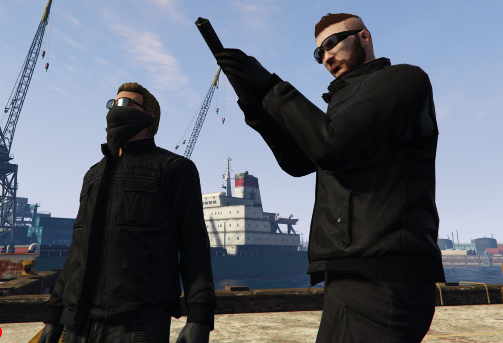
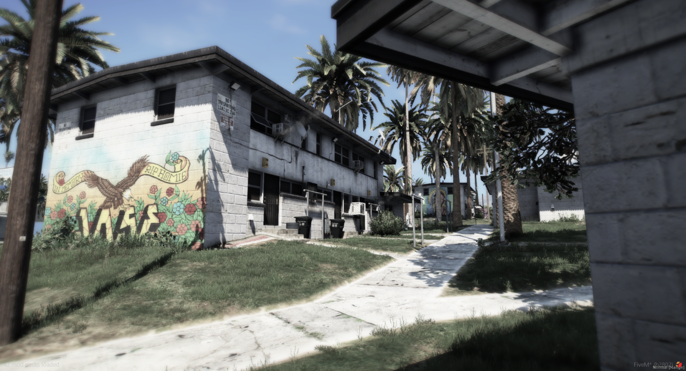
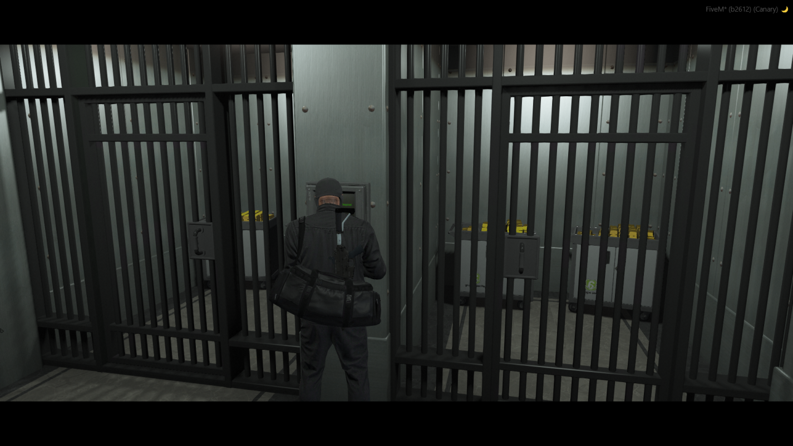
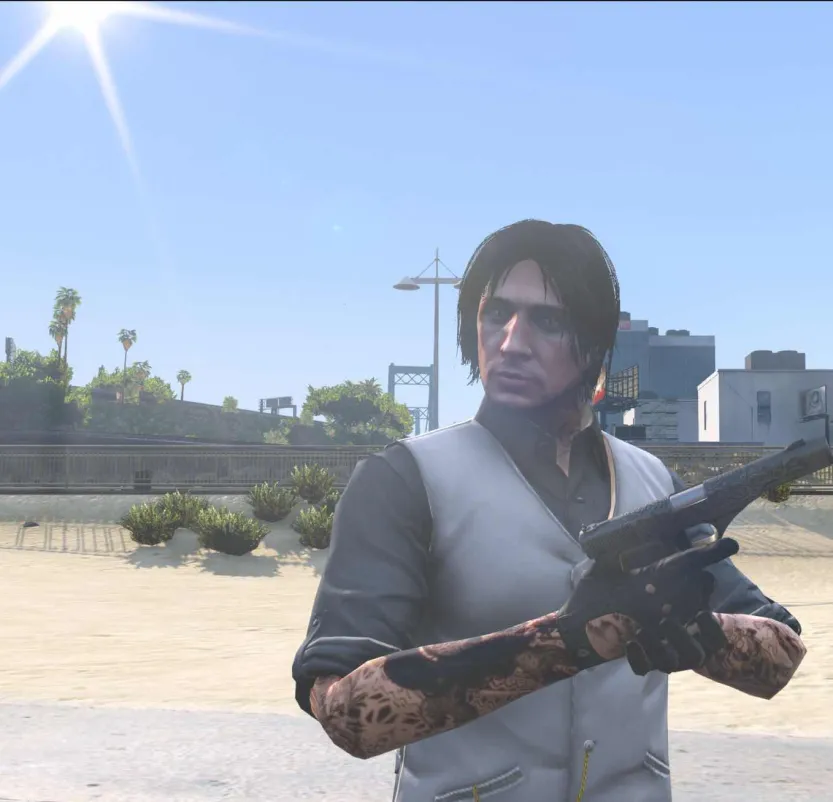
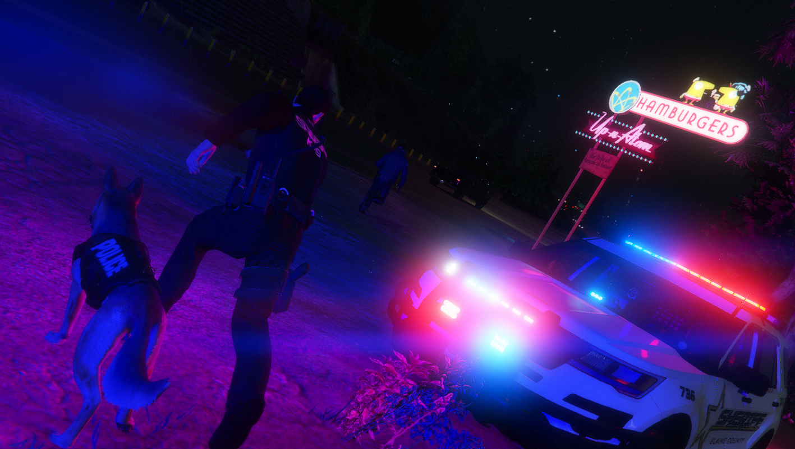
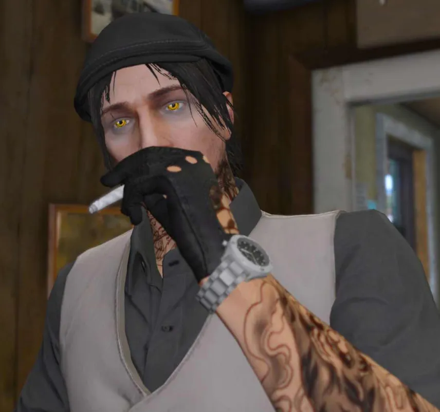

# Crime & The Underworld

*The law has rules. The streets have different ones.*

---

## A Word of Warning

> *"Everyone's got a plan until the cops show up."*

Crime in Los Santos isn't a game mechanic - it's a **lifestyle choice** for your character. The money's good. The freedom's intoxicating. But the consequences?

Those are real too.

**Before you continue, understand:**
- Police WILL respond
- Jail time WILL happen
- Your record WILL follow you
- Bad decisions WILL cost you

Still interested? Let's talk business.

---

## The Criminal Ladder

Not all crime is created equal. There's a progression - a ladder from petty theft to organized empire.

### Tier 1: Street Level

*The Jamestown projects - Where careers begin*

| Activity | Risk | Reward | Cop Requirement |
|----------|------|--------|-----------------|
| **Shoplifting** | Low | $ | None |
| **Drug Sales** | Low-Med | $ | None |
| **Car Theft** | Medium | $$ | None |
| **Mugging** | Medium | $ | None |

> **Starting Out:**
> *Your hands shake as you stuff the convenience store candy into your jacket. The clerk's back is turned. The door is right there. This is stupid. This is so stupid. But rent was due yesterday and—the door chimes as you push through. Fresh air. Freedom. You're a criminal now. For a $3 candy bar.*

### Tier 2: Organized Crime

| Activity | Risk | Reward | Cop Requirement |
|----------|------|--------|-----------------|
| **Store Robbery** | Medium | $$ | None |
| **Drug Production** | Medium | $$$ | None (raidable) |
| **Fleeca Banks** | High | $$$ | 2+ cops |

### Tier 3: The Big Leagues

*Pacific Standard - The score everyone dreams about*

| Activity | Risk | Reward | Cop Requirement |
|----------|------|--------|-----------------|
| **Pacific Standard** | Extreme | $$$$ | 4+ cops |
| **Yacht Heist** | Extreme | $$$$ | 4+ cops |
| **Jewelry Store** | High | $$$ | 3+ cops |

---

## Robbery Systems

### Store Robberies

The entry point for any aspiring criminal.

**How It Works:**
1. Find a store (24/7, liquor stores)
2. Wait for the right moment
3. Threaten the clerk
4. Clean out the register
5. **Get out fast**

> **RP Scenario:**
> *"Open the register. Now." Your voice cracks. The clerk's hands tremble as she presses the buttons. "Please, I have kids—" You didn't expect this. In the movies, nobody talks. "Just... just hurry up." The drawer pops open. Sirens in the distance. Time to go.*

**Tips:**
- Masks on **before** you enter
- Have a getaway driver
- Don't hurt the clerk (it's worse charges)
- Know your escape route

### Ammunation Hits

Higher risk, better rewards. These shops have **weapons**, which means:
- Armed employees possible
- Faster police response
- Better loot

### Fleeca Banks

*Small banks, big dreams*

Your first "real" job. Fleeca branches are scattered across the city - smaller, easier to crack, but still a serious crime.

**Requirements:**
- Minimum 2 cops online
- Hacking/lockpicking tools
- A solid crew (2-4 recommended)
- Getaway vehicle(s)

**The Process:**
1. **Entry** - Hack, drill, or blow the door
2. **Control** - Handle civilians, watch for cops
3. **Vault** - Crack the safe
4. **Escape** - The hardest part

> **Inside the Vault:**
> *The drill screams against steel. Your lookout's voice crackles in your ear: "Cops, two minutes out." The safe door groans. "Come on, come on..." It swings open. Stacks of cash. Beautiful. "Thirty seconds!" You grab everything you can. Time to run.*

### Paleto Bay Savings

**Mid-tier difficulty.** More security, more cash, more heat.

**Entry Methods:**
- C4 (loud)
- Thermite (medium)
- Laptop hacking (quiet)
- Drilling (slow but reliable)

**Special Challenges:**
- Laser security grids
- Multiple vaults
- Remote location (long police response, but also long escape)

### Pacific Standard

The **crown jewel**. The score that makes legends or prisoners.

*Every detail matters*

**Why It's Legendary:**
- Highest payout in the city
- Maximum security
- Requires 4+ cops online
- Multiple stages
- Everything can go wrong

**What You're Up Against:**
- Laser security throughout
- Reinforced doors
- Camera systems (cops can monitor)
- SWAT response likely

> **The Moment of Truth:**
> *You stand in the vault. More money than you've ever seen. Your crew is loading bags. Outside, you can hear the sirens - dozens of them. The helicopter's searchlight sweeps past the window. This is it. The moment you either become a legend or spend the next decade in Bolingbroke. Deep breath. "Let's move."*

---

## The Drug Trade

*Blaine County back roads - Where product moves*

Two paths to profit:

### Production

**Lower risk, steady income.** You're not on the street - you're the supplier.

| Product | Complexity | Profit Margin |
|---------|------------|---------------|
| **Weed** | Low | $ |
| **Cocaine** | Medium | $$$ |
| **Meth** | High | $$$$ |

**The Setup:**
- Find/buy a location
- Get equipment
- Source materials
- Maintain production
- Avoid raids

> **The Cook:**
> *The lab hums with equipment. Beakers bubble. You've done this a hundred times, but one wrong move and the whole place goes up. Sweat drips down your temple. Chemistry was never your strong suit in school. Funny how things change.*

### Street Sales

**Higher risk, faster cash.** You're moving product directly.

**Corner Selling:**
- Find a good spot
- Watch for cops
- Know your customers
- Don't stay in one place too long

> **The Deal:**
> *The car pulls up slow. Window rolls down. "You got it?" You nod, lean in close. Money changes hands. Product disappears into the car. They drive off. You check the cash. Short. Always short. But what are you gonna do, call the cops?*

---

## Gang Life

*Family isn't always blood*

Gangs offer something solo criminals don't have: **backup**.

### What Gangs Provide

| Benefit | Description |
|---------|-------------|
| **Territory** | Areas you control |
| **Protection** | Brothers watching your back |
| **Resources** | Shared income, supplies |
| **Identity** | Colors, signs, reputation |

### Gang Activities

- **Territory control** - Claim and defend your turf
- **Corner selling** - Drug distribution
- **Crew missions** - Organized operations
- **Rival conflicts** - War has consequences

> **The Meeting:**
> *"You want in?" The OG stares at you, arms crossed. Behind him, the crew watches. "Once you're in, you're in for life. This ain't a job. It's family." You look around the room. These aren't strangers anymore. They're brothers. You nod. He extends a fist. "Welcome to the set."*

*Vagos control the Jamestown projects*

---

## Special Operations

### Smuggler's Run

Late night. Mask on. Find the smuggler near the docks.

**How It Works:**
1. Pay the upfront fee
2. Receive mission details
3. Collect cargo from remote locations
4. Fly to private airstrips
5. Deliver to contacts

**Risks:**
- 50% chance police get alerted on contact
- 20 minute cooldown between runs
- Long distances, exposed routes

### Yacht Heist

Maritime operation. Board a luxury yacht, take everything.

**Requirements:**
- 4+ cops online
- Boat or helicopter access
- Good crew
- Exit strategy (sea or air)

---

## When It Goes Wrong

### Police Response

| Crime Level | Response |
|-------------|----------|
| **Petty** | 1-2 units |
| **Robbery** | 3-4 units |
| **Bank Job** | Full response |
| **Major Heist** | SWAT + Air |

*They will find you*

### Getting Caught

**What Happens:**
1. **Arrest** - You're going in
2. **Processing** - Charges filed
3. **Court** - Maybe (if you want to fight it)
4. **Jail Time** - Based on charges
5. **Record** - Follows you forever

> **The Ride:**
> *The handcuffs bite into your wrists. The cop reads you your rights, but the words blur together. In the rearview mirror, you watch your freedom disappear. The score failed. The crew scattered. And now? Now you're just another number in the system.*

### Consequences

| Charge | Fine | Jail Time |
|--------|------|-----------|
| Petty Theft | $ | Minutes |
| Armed Robbery | $$$ | Hours |
| Bank Robbery | $$$$ | Serious |
| Murder | $$$$$ | Extreme |

---

## The Criminal's Code

Not rules - guidelines. Honor among thieves.

### 1. Don't Snitch
Nobody likes a rat. Even cops respect criminals who don't talk.

### 2. Keep Your Word
Your reputation is everything. Break a deal once, nobody deals with you again.

### 3. Know When to Fold
Greed kills. Take the score and run. Don't push your luck.

### 4. Respect the RP
This is a story, not a grind. Make it interesting for everyone - including the cops chasing you.

> **The Choice:**
> *The cop's got you cornered. Alley dead end. Gun trained on your chest. "Drop it!" You could shoot. Maybe you'd get lucky. But probably not. The gun clatters to the ground. "Alright. You got me." The cop lowers his weapon slightly. "Smart choice." At least you'll live to try again.*

---

## Building a Reputation

**In crime, your name matters.**

| Reputation | Effect |
|------------|--------|
| **Unknown** | Nobody trusts you |
| **Up-and-comer** | Getting noticed |
| **Reliable** | People seek you out |
| **Legendary** | Crews want you, cops fear you |

How to build it:
- Complete jobs successfully
- Don't rat
- Pay your debts
- Help your crew
- Stay alive

---

## The Bottom Line

*The streets remember everything*

Crime isn't just about money. It's about the stories you tell, the reputation you build, and the life you choose.

Some players rob banks to get rich.
The best players rob banks to create **memorable moments**.

The money disappears. The stories? Those last forever.

> *"I'm not in this for the cash. I'm in it for the rush. For the moment when everything's on the line and you either make it or you don't. That moment when you're truly alive."*

---

**Choose wisely. The city is watching.**
