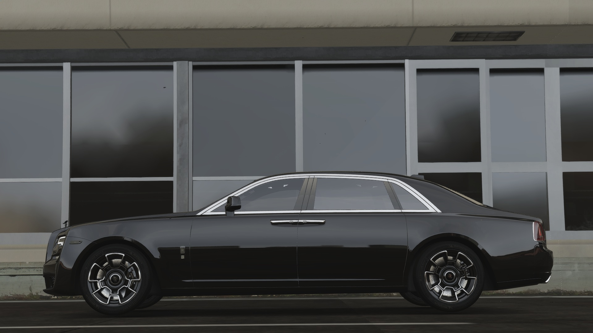

# Vehicle Dealerships Guide

*Where automotive dreams become reality*

---

## The Showroom Experience

> *The door swings open. Air conditioning hits your face. Rows of gleaming cars stretch before you - sports cars, luxury sedans, motorcycles. A salesman approaches, smile too wide. "Looking for anything specific?" You nod toward the supercar in the corner. "That one." He checks the price tag. "Excellent taste. Let's talk financing..."*

Buying a vehicle in Los Santos is more than a transaction - it's a milestone. Your first car means freedom. Your first supercar means success. Know where to shop and how to buy smart.

---

## Dealership Locations

### Where to Shop

| Dealership | Specialty | Location | Price Range |
|------------|-----------|----------|-------------|
| **Premium Deluxe Motorsport** | Sports/Luxury | Pillbox Hill | $$$-$$$$ |
| **Simeon's** | Budget/Used | La Mesa | $-$$ |
| **Boat Dealership** | Watercraft | Vespucci | $$-$$$ |
| **Air Dealership** | Aircraft | LSIA | $$$$+ |
| **Motorcycle Dealer** | Bikes | Various | $-$$$ |

### Premium Deluxe Motorsport (PDM)

*The premier destination for serious buyers*

The flagship dealership. If it's expensive and fast, it's here.

**What You'll Find:**
- Sports cars and supercars
- Luxury sedans and SUVs
- High-end motorcycles
- Premium service

> **RP Scenario:**
> *The salesman leads you to the back lot. "This just came in. Limited production. You won't see another one on the streets." You circle the car slowly, running your hand along the curves. "How much?" He names a number that makes your heart skip. "That's... a lot." He nods. "Quality costs."*

### Simeon's Premium Deluxe

For those building up:
- Budget-friendly options
- Used vehicles in good condition
- First-time buyer specials
- No judgment zone

---

## Buying Options

### Cash Purchase

The simple way - if you've got the money:

1. **Browse** - Walk the lot, check the inventory
2. **Select** - Pick your vehicle
3. **Pay** - Full price from your bank
4. **Drive** - Keys in hand, it's yours

**Advantages:**
- No ongoing payments
- No interest charges
- Immediate full ownership
- Clean and simple

> **The Cash Buyer:**
> *You count the bills. All there. The salesman's eyes widen as you stack it on the counter. "Cash purchase," you say simply. No questions asked. No financing paperwork. Just keys and a handshake.*

---

### Financing

Can't afford full price? Finance it.

| Term | Details |
|------|---------|
| **Down Payment** | 10% of vehicle price |
| **Interest Rate** | 10% total |
| **Payments** | 12 installments |
| **Frequency** | Every 24 hours (real time) |

### Example: $100,000 Vehicle

| Item | Amount |
|------|--------|
| Down Payment | $10,000 |
| Amount Financed | $90,000 |
| Interest (10%) | $9,000 |
| Total Owed | $99,000 |
| Monthly Payment | $8,250 |

### How to Finance

1. Select vehicle at dealership
2. Choose "Finance" option
3. Pay the down payment
4. Vehicle is registered to you
5. Make payments on schedule

> **The Finance Deal:**
> *"Look, I can only put down ten thousand right now." The salesman nods, tapping at his tablet. "That's fine. Twelve payments of eight-two-fifty. Miss a payment and..." He draws his finger across his throat. "Repo. Understand?" You understand perfectly.*

### Payment Management

**Automatic Deductions:**
- Payments pull from your bank automatically
- Keep funds available on payment days
- Check payment status in your phone banking app

**Missing Payments:**
| What Happens | Consequence |
|--------------|-------------|
| Insufficient funds | Payment fails |
| Multiple misses | Vehicle repossessed |
| Repossession | Lose vehicle, lose payments made |

> **Warning:** Don't overextend. A repossessed car means lost money and no wheels.

---

## Test Drives

*Try before you buy*

### How It Works

1. Select the vehicle you're interested in
2. Choose "Test Drive"
3. Take it for a limited spin
4. Return to dealership
5. Decide to buy or walk

### Test Drive Tips

| Tip | Why |
|-----|-----|
| **Check handling** | Does it fit your driving style? |
| **Test speed** | Is it fast enough? |
| **Check visibility** | Can you see in all directions? |
| **Feel the brakes** | Stop distance matters |

> **The Test:**
> *The engine roars to life. You pull onto the street, feeling the power. Corner ahead - how's the handling? Perfect. You smile. This is the one. Now you just need to figure out how to pay for it.*

---

## Vehicle Categories

### By Price Range

| Category | Price Range | Best For |
|----------|-------------|----------|
| **Economy** | $5K - $25K | First-time buyers |
| **Standard** | $25K - $75K | Reliable daily drivers |
| **Sports** | $75K - $200K | Speed enthusiasts |
| **Super** | $200K - $500K | Serious collectors |
| **Luxury** | $500K+ | Status symbols |

### By Type

| Type | Description | Where to Buy |
|------|-------------|--------------|
| **Sedans** | 4-door family cars | PDM, Simeon's |
| **Coupes** | 2-door sports | PDM |
| **SUVs** | Off-road capable | PDM, Simeon's |
| **Motorcycles** | Two-wheelers | Motorcycle Dealer |
| **Boats** | Watercraft | Boat Dealership |
| **Aircraft** | Planes and helicopters | Air Dealership |

---

## License Requirements

Some vehicles require proper licensing:

| Vehicle Type | License Required | Where to Get |
|--------------|------------------|--------------|
| Standard Cars | Driver's License | DMV |
| Motorcycles | Motorcycle License | DMV |
| Aircraft | Pilot's License | Flight School |
| Boats | Boat License | Harbor Master |

> **Pro Tip:** Get your licenses before you shop. Nothing worse than buying a bike you can't legally ride.

---

## After Purchase

### What You Get

When you complete a purchase:
- **Keys** - Access to your vehicle
- **Registration** - Proof of ownership
- **Insurance** - Basic coverage included
- **Garage Spot** - Added to your storage

### Customization

Your new ride is ready for personalization:
- Take it to a mechanic shop
- Choose paint, wheels, performance upgrades
- Make it uniquely yours

### If Something Goes Wrong

| Problem | Solution |
|---------|----------|
| Can't find vehicle | Check your garages |
| Vehicle impounded | Retrieve from police lot |
| Vehicle destroyed | Claim insurance at mechanic |

---

## Player-Run Dealerships

Some dealerships are operated by players:

### Advantages

| Benefit | What It Means |
|---------|---------------|
| **Negotiable prices** | Haggle for a better deal |
| **Personal service** | Real RP experience |
| **Custom orders** | Request specific vehicles |
| **Trade-ins** | Sell your old car |

### The Experience

> **RP Scenario:**
> *"This one's been sitting here for weeks. I could knock ten percent off." The dealer crosses his arms. "It's got low miles, clean title. What are you offering?" You think fast. "Fifteen percent off and you throw in a full tank." He considers. Extends his hand. "Deal."*

---

## Buying Smart

### Do's

| Action | Why |
|--------|-----|
| Test drive first | Know what you're buying |
| Check garage space | Can you store it? |
| Compare dealers | Different stock, different prices |
| Calculate payments | Can you afford the monthly? |
| Get proper license | Don't buy what you can't drive |

### Don'ts

| Action | Consequence |
|--------|-------------|
| Buying impulsively | Regret later |
| Overextending on financing | Risk repossession |
| Ignoring insurance | Expensive repairs |
| Forgetting about fuel | Different cars burn different amounts |
| Skipping test drives | Buying problems |

---

## Tips for First-Time Buyers

1. **Start modest** - Your first car doesn't need to be a supercar
2. **Prioritize reliability** - Get where you need to go
3. **Consider costs** - Fuel, repairs, insurance
4. **Think about storage** - Where will you park it?
5. **Save for the future** - Your dream car can wait

> **The First Car:**
> *It's not pretty. The paint's faded. The engine rattles. But when you turn that key and it starts? When you pull out of the lot in YOUR car? None of that matters. This is freedom. This is the beginning.*

---

## The Bottom Line

Buying a car is one of the biggest purchases you'll make in Los Santos. Take your time. Test drive. Do the math. Whether you're getting your first beater or your dream supercar, make sure it's the right choice.

---

*Every collection starts with one. Make it count.*

---

**Now go find your wheels.**
