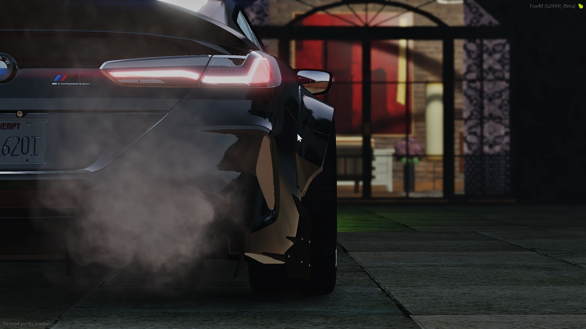
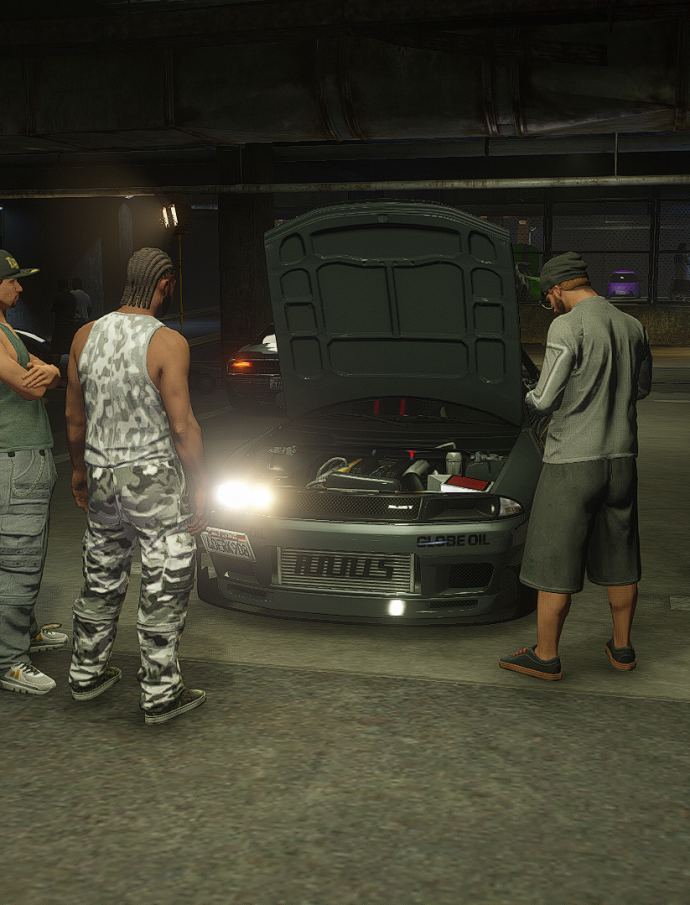

# Vehicle Dealerships Guide

*Browse the finest vehicles in Los Santos*

How to buy your dream car in Los Santos.

## Overview

DPSRP uses **jg-dealerships** for vehicle sales with full financing options, test drives, and multiple dealership locations.

## Dealership Locations

| Dealership | Specialty | Location |
|------------|-----------|----------|
| Premium Deluxe Motorsport | Sports/Luxury | Pillbox Hill |
| Simeon's | Budget/Used | La Mesa |
| Boat Dealership | Watercraft | Vespucci |
| Air Dealership | Aircraft | LSIA |
| Motorcycle Dealer | Bikes | Various |

## Buying a Vehicle

### Cash Purchase
1. Visit any dealership
2. Browse available vehicles
3. Select your vehicle
4. Choose "Buy Now"
5. Pay full price from bank
6. Receive keys and registration

### Financing (Recommended for Expensive Vehicles)

Financing lets you buy vehicles you can't afford outright.

| Term | Details |
|------|---------|
| Down Payment | 10% of vehicle price |
| Interest Rate | 10% total |
| Payment Schedule | 12 installments |
| Payment Frequency | Every 24 hours (real time) |

**Example: $100,000 Vehicle**
- Down payment: $10,000
- Total financed: $90,000 + $9,000 interest = $99,000
- 12 payments of: $8,250 each

### How to Finance
1. Select vehicle at dealership
2. Choose "Finance"
3. Pay down payment
4. Vehicle is yours!
5. Make payments on time

### Missing Payments
- Payments auto-deduct from bank
- If insufficient funds, vehicle may be repossessed
- Check payment status in phone banking app

## Test Drives

*Take your new ride to a meet and show it off*

Before buying, take it for a spin:
1. Select vehicle
2. Choose "Test Drive"
3. Limited time/area to drive
4. Return to dealership
5. Decide to purchase or not

## Vehicle Categories

### By Price Range
| Category | Price Range |
|----------|-------------|
| Economy | $5,000 - $25,000 |
| Standard | $25,000 - $75,000 |
| Sports | $75,000 - $200,000 |
| Super | $200,000 - $500,000 |
| Luxury | $500,000+ |

### By Type
- **Sedans** - 4-door family cars
- **Coupes** - 2-door sports
- **SUVs** - Off-road capable
- **Motorcycles** - Two-wheelers
- **Boats** - Watercraft
- **Aircraft** - Planes and helicopters

## License Requirements

Some vehicles require licenses:
| Vehicle Type | License Required |
|--------------|------------------|
| Standard Cars | Driver's License |
| Motorcycles | Motorcycle License |
| Aircraft | Pilot's License |
| Boats | Boat License |

Get licenses at the DMV or through the licensing office.

## After Purchase

### Registration
- Vehicles are automatically registered to you
- Plate is assigned (can be customized later)
- Added to your garage

### Insurance
- All purchased vehicles include basic insurance
- Claim insurance at mechanic shops if destroyed

### Where's My Car?
- Check your garage (see Vehicles guide)
- If impounded, retrieve from police impound lot
- Use phone GPS to locate

## Employee Dealerships

Some dealerships are player-run:
- May offer better deals
- Can negotiate prices
- Custom orders possible
- Roleplay the purchase experience

## Tips

1. **Test drive first** - Make sure you like it
2. **Finance wisely** - Don't overextend yourself
3. **Compare prices** - Different dealers, different stock
4. **Check garage space** - Make sure you can store it
5. **Save for insurance** - Repairs cost money
6. **Buy what you need** - A supercar won't help for trucking jobs
