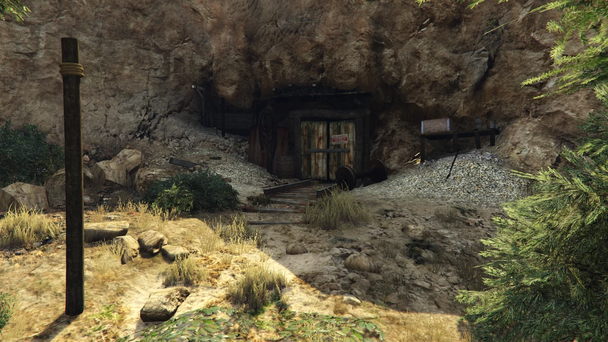

# Factories Guide


*Build your manufacturing empire*

GTA Online-style business ownership on DPSRP.

## Overview

DPSRP uses **lc_factories** for a comprehensive business ownership system where you can purchase factories, manage production lines, and sell products for profit.

## Available Factories

| Factory | Product Type | Starting Price |
|---------|--------------|----------------|
| Coca-Cola Factory | Beverages | Varies |
| Vehicle Factory | Vehicle parts | Varies |
| Electronics Factory | Electronics | Varies |
| Weapons Factory | Weapons | Varies |
| Custom Factories | Server-specific | Varies |

## Purchasing a Factory

### Finding Factories
1. Look for factory locations on the map
2. Visit the property
3. Check if it's for sale
4. Access the purchase menu

### Requirements
- Sufficient funds (cash or bank)
- No existing factory of same type (typically)
- Meet any reputation requirements

### Multiple Owners
Each factory location can have different owners - multiple players can own separate factories across the city.

## Factory Interface

### Main Dashboard
- **Production Lines** - Your manufacturing setup
- **Stock** - Current inventory
- **Employees** - Staff management
- **Upgrades** - Improvements
- **Bank** - Factory finances
- **Statistics** - Performance data

## Production System

### How Production Works

```
Farms → Raw Materials → Machines → Products → Sales
```

### Production Lines
Design your production chain using a flowchart interface:

1. **Farms** - Generate raw materials
   - Wood, water, coal, etc.
   - Base resources for production

2. **Machines** - Process materials
   - Convert raw materials to products
   - Can be upgraded for efficiency

3. **Vehicles** - Internal transport
   - Move materials within facility
   - Upgrade for faster transport

### Managing Production
1. Access production line interface
2. Place and connect equipment
3. Assign materials flow
4. Start production
5. Collect finished products

## Supplies

### Obtaining Supplies

**Buying Supplies**
- Purchase from trademarket
- Costs money
- Instant delivery
- Safe and reliable

**Stealing Supplies**
- Free method
- Risky missions
- Less supplies per run
- May attract attention

### Supply Types
| Material | Used For |
|----------|----------|
| Raw materials | Base production |
| Components | Advanced products |
| Chemicals | Specialty items |

## Selling Products



*Production facilities across the state*

### Trademarket
- Sell finished products
- Set your prices
- Buy from other players
- Create purchase orders

### Sale Locations
Products can be sold at various locations:
| Region | Price per Unit |
|--------|----------------|
| Los Santos | Base price |
| Blaine County | +33% |
| Paleto Bay | +78% |

**Risk vs Reward:** Farther deliveries pay more but have more risk!

## Upgrades

### Available Upgrades
| Upgrade | Effect |
|---------|--------|
| Stock Capacity | Store more materials/products |
| Machine Efficiency | Faster production |
| Garage | More delivery vehicles |
| Production Lines | Additional manufacturing chains |
| Security | Reduce raid chance |

### Upgrade Strategy
1. **Stock first** - More storage = longer runs
2. **Machines second** - Faster production
3. **Security third** - Protect your investment
4. **Lines last** - Expand when profitable

## Employee Management

### Hiring Employees
- Hire other players
- Set permissions for each role
- Pay wages from factory funds

### Employee Roles
| Role | Permissions |
|------|-------------|
| Worker | Production only |
| Driver | Deliveries |
| Manager | Most operations |
| Co-Owner | Nearly full access |

### Managing Staff
- Set work schedules
- Monitor performance
- Adjust pay rates
- Promote/demote as needed

## Factory Bank

### Managing Finances
- All sales deposit to factory bank
- Pay for supplies from bank
- Employee wages auto-deducted
- Track income vs expenses

### Withdrawing Profits
- Transfer to personal account
- Keep operating funds in factory
- Plan for supply purchases

## Statistics & Analytics

### Tracked Data
- Total production
- Sales history
- Profit margins
- Employee productivity
- Supply consumption
- Delivery success rate

### Using Statistics
- Identify bottlenecks
- Optimize production
- Track profitability
- Plan expansion

## Security & Raids

### Protecting Your Factory
- Invest in security upgrades
- Don't stockpile too much
- Sell regularly
- Stay under the radar

### If Raided
- Some product/supplies may be lost
- Security reduces losses
- Rebuild and continue

## Tips for Success

### Starting Out
1. **Start small** - Learn the system
2. **Reinvest profits** - Grow sustainably
3. **Balance production** - Don't overproduce
4. **Sell regularly** - Don't hoard

### Advanced Strategies
1. **Vertical integration** - Own suppliers
2. **Hire drivers** - Focus on production
3. **Market timing** - Sell when demand high
4. **Network** - Partner with other owners
5. **Diversify** - Multiple factory types

### Economy Management
- Track all expenses
- Know your profit margins
- Factor in risk costs
- Plan for slow periods

## Commands

| Command | Description |
|---------|-------------|
| Access factory | At factory location |
| Production menu | Inside factory |
| Trademarket | From phone/location |

## Factory Locations

Check the in-game map for factory icons marking available and owned properties. Each location offers different advantages based on proximity to:
- Supply sources
- Delivery destinations
- Other businesses
- Customer base
