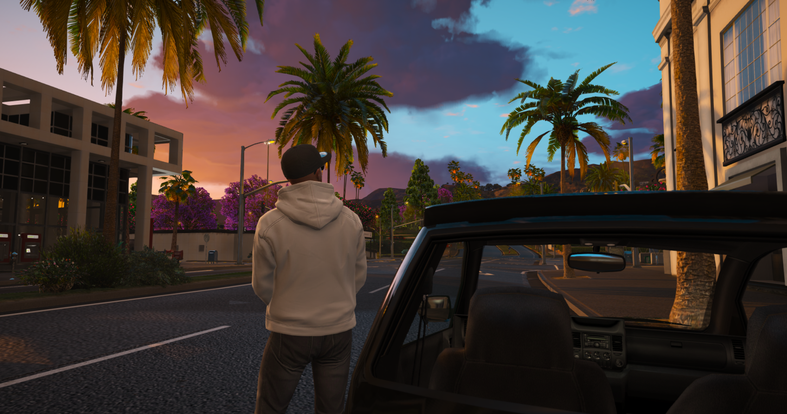
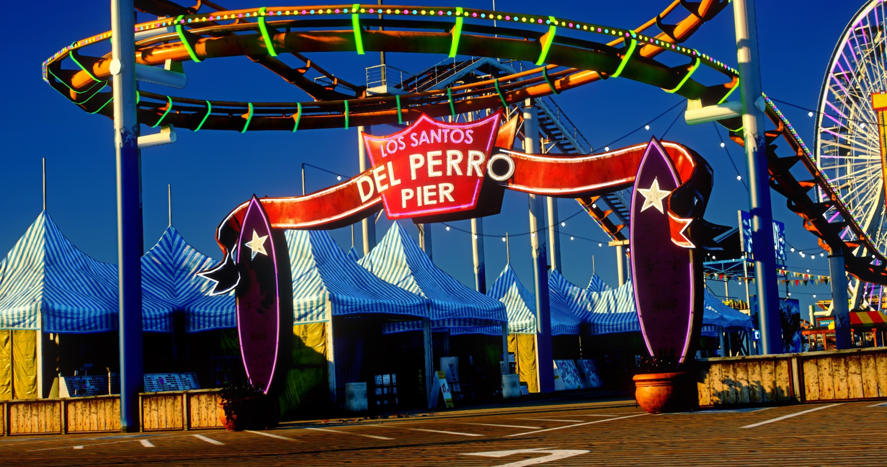
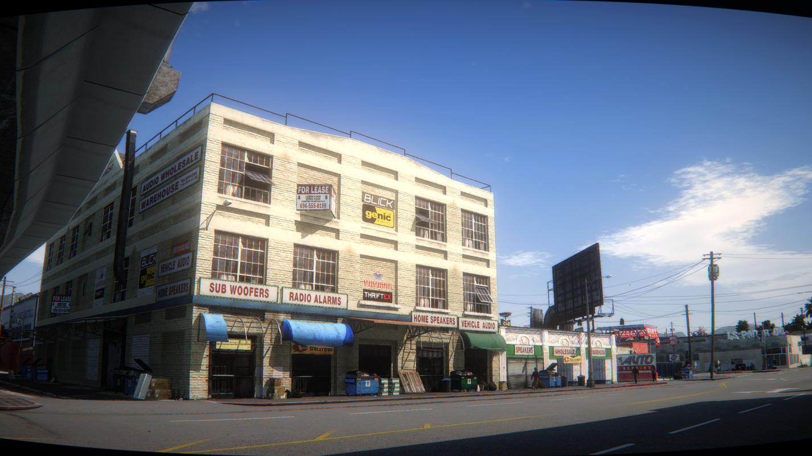
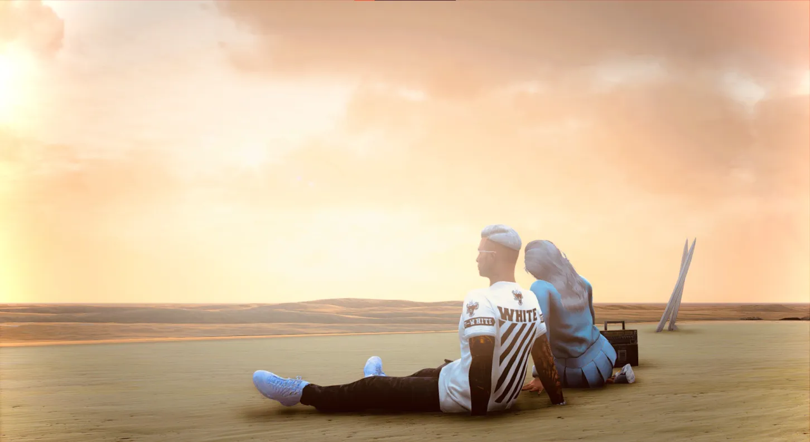

# Getting Started

*The sun sets on Del Perro Beach. Somewhere out there, your story is about to begin.*

---

Welcome to **DPSRP** - a roleplay server where every player writes their own story. Whether you want to become a respected police officer, a notorious crime boss, a humble taxi driver, or anything in between, it all starts here.

> **Your First Moment:**
> *You step off the bus at Legion Square, squinting in the California sun. The city stretches before you - towering skyscrapers, palm-lined boulevards, and endless possibilities. A stranger bumps past you, muttering an apology. In the distance, sirens wail. This is Los Santos. This is home now.*

---

## Creating Your Character

When you first connect, you'll enter the **character selection screen** - your gateway to a new life.

### Character Slots

| Slot Type | Available |
|-----------|-----------|
| **Standard Slots** | 4 characters |
| **VIP Slots** | Additional for supporters |

### Building Your Identity

This is the most important decision you'll make. Your character isn't just a name - they're a **person** with a history, goals, and a personality.

**Think about:**
- Where did they come from?
- Why did they move to Los Santos?
- What do they want out of life?
- What are their flaws?

> **RP Tip:** A good character has *weaknesses*. The perfect hero is boring - but the ex-con trying to go straight? The cop haunted by a case gone wrong? That's interesting.

### Creation Steps

1. **Select an empty slot** - Pick your character space
2. **Design your look** - Customize face, hair, body type
3. **Set your identity** - First name, last name, birthday, nationality
4. **Confirm** - Your new life begins

---

## Choosing Where to Begin

*Del Perro Pier - Tourists, street performers, and the smell of funnel cake*

After creating your character, you'll choose a **spawn location**. Each area has its own vibe:

### Urban Spawns

| Location | Vibe | Good For |
|----------|------|----------|
| **Legion Square** | Busy downtown hub | Meeting people, central access |
| **Del Perro Pier** | Beachfront entertainment | Casual RP, tourism |
| **Vespucci Beach** | Muscle beach, boardwalk | Fitness RP, beach life |

### Suburban & Rural Spawns

| Location | Vibe | Good For |
|----------|------|----------|
| **Grapeseed Farm** | Quiet countryside | Peaceful start, farming RP |
| **Paleto Bay** | Small-town America | Slower pace, close community |
| **Roxwood** | Central services area | Quick access to essentials |

> **RP Scenario:**
> *"Fresh start," you mutter, stepping onto Paleto Bay pier. The fishing boats creak against their moorings. An old man looks up from his tackle box. "New in town?" he asks. You nod. He gestures to the stool beside him. "Pull up a seat. Fish ain't biting anyway."*

---

## Your First 30 Minutes

*The city never sleeps - and neither do the opportunities*

### Step 1: Get Your Phone

Your **phone** (press `F1`) is your lifeline. It handles:

| App | What It Does |
|-----|--------------|
| **Calls/Texts** | Contact other players |
| **Bank** | Check balance, transfer money |
| **GPS** | Navigate the city |
| **Jobs** | Find employment |
| **Social Media** | Stay connected |

### Step 2: Handle Your Money

*Maze Bank - Where dreams are funded (or crushed)*

Visit any **Maze Bank** location to:
- Open your bank account
- Deposit your starting cash (**keep it safe!**)
- Get a debit card

> **Pro Tip:** Never carry all your cash on you. If you get robbed, you lose what's in your pockets. Bank it!

### Step 3: Get Moving

**Walking everywhere gets old fast.** Your options:

| Method | Cost | Notes |
|--------|------|-------|
| **Walking** | Free | Slow but scenic |
| **Bus** | Cheap | Fixed routes, schedules |
| **Taxi** | $$ | Call from phone, door-to-door |
| **Buy a car** | $$$ | Visit PDM when you save up |

### Step 4: Find Work

No money means no food, no rent, no life. **Get a job:**

- Look for NPCs at businesses (they have interaction prompts)
- Check job centers around the city
- Ask other players - networking matters!

> **RP Scenario:**
> *The manager at Burger Shot looks you up and down. "You got experience?" You hesitate. "I... can learn fast?" She sighs, slides a uniform across the counter. "Everyone starts somewhere. Don't burn the patties."*

---

## Essential Controls

Master these and you'll master the city:

### Movement & Interaction

| Key | Action |
|-----|--------|
| `W A S D` | Move around |
| `Shift` | Sprint |
| `E` | Interact with objects/people |
| `G` | Open radial menu |
| `Left Alt` | Target system (hold) |

### Communication

| Key | Action |
|-----|--------|
| `T` | Open text chat |
| `N` | Push-to-talk (voice) |
| `` ` `` | Cycle voice range (whisper/normal/shout) |
| `Y` | Quick /me command |

### Essential Menus

| Key | Opens |
|-----|-------|
| `F1` | Your phone |
| `F2` | Inventory |
| `F5` | Emote menu |
| `F10` | This guidebook |
| `M` | Map |
| `Escape` | Pause menu |

---

## The Golden Rules

These aren't suggestions - they're the foundation of good roleplay:

### 1. Stay In Character
You're not *you* - you're your character. React as they would, not as you would.

### 2. Value Your Life
If someone points a gun at you, **act scared**. Your character doesn't want to die.

> **Wrong:** *Gets shot at* "Whatever, I'll just respawn."
>
> **Right:** *Hands shake as you slowly raise them* "Please... I have a family..."

### 3. No Random Violence
Every conflict needs a **reason**. Don't just attack people for fun.

### 4. No Metagaming
If you learned it on Discord, your character doesn't know it. Period.

### 5. Respect Everyone
Behind every character is a real person. Be cool.

---

## Getting Help

Lost? Confused? We've all been there.

| Method | When To Use |
|--------|-------------|
| `F10` / `/help` | Open this guidebook |
| `/report [message]` | Contact staff for issues |
| **Discord #help** | Ask the community |
| **Ask in-character** | Best way to learn! |

> **RP Tip:** Don't be afraid to ask other characters for directions or help. It's great RP and most players love helping newcomers in character.

---

## Your Story Starts Now

*Every legend started with a first step*

You've got the basics. Now comes the real adventure:

1. **Explore** - The city is massive. Get lost in it.
2. **Talk to people** - Every stranger could become your best friend or worst enemy
3. **Take risks** - The best stories come from unexpected moments
4. **Build your reputation** - Your name will mean something eventually
5. **Have fun** - This is a game. Enjoy it.

> *Six months from now, you might be running a business empire. You might be the city's most wanted criminal. You might be the cop who finally brings them down. The only question is: what's your first move?*

---

**Welcome to Los Santos. Make it count.**
