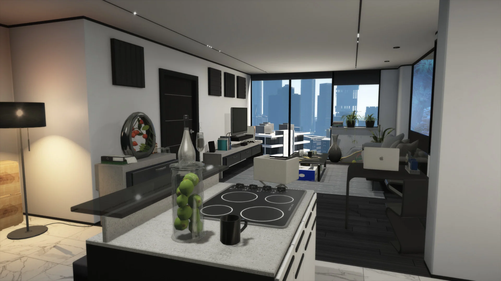
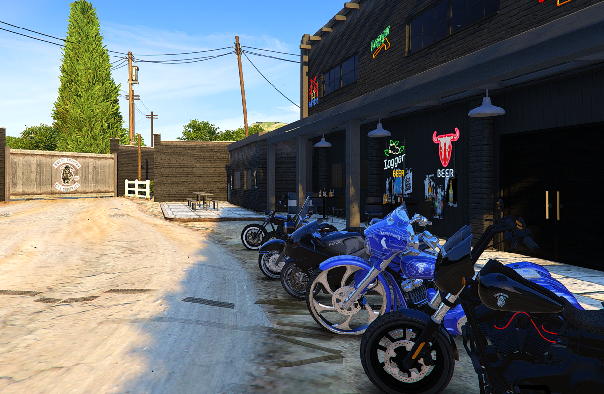

# Hidden Interiors (GTA Online IPLs)

*Discover hidden locations throughout Los Santos*

Los Santos contains many hidden interiors from GTA Online that are accessible throughout the city. Look for **NPC guides** standing near building entrances - they can teleport you inside these exclusive locations.

## How It Works

1. Find an NPC guide near a building entrance
2. Interact with the NPC (press E)
3. Select your destination from the menu
4. You'll be teleported inside the interior
5. Look for exit points inside to return outside

## CEO Offices

High-rise executive offices for the business elite.

### Maze Bank Tower
**Location:** LS Financial District
- Helipad (rooftop access)
- Executive Office
- Personal Modshop
- Multi-level Garage

### Arcadius Business Center
**Location:** Pillbox Hill
- Helipad
- Executive Office
- Personal Modshop
- Multi-level Garage

### West Maze Bank
**Location:** Del Perro
- Helipad
- Executive Office
- Personal Modshop
- Multi-level Garage

### Lombank West
**Location:** Del Perro
- Helipad
- Executive Office
- Garage

## Nightlife & Entertainment

*High-stakes entertainment*

### Diamond Casino & Resort
**Location:** Vinewood
- Casino Floor (gambling)
- Parking Garage
- Penthouse Suite

### Galaxy Nightclub
**Location:** Downtown LS
- Full nightclub access
- Dance floor
- VIP areas

### The Music Locker
**Location:** Casino basement
- Underground music venue
- Live DJ booth

### Split Sides Comedy
**Location:** Vinewood
- Comedy club interior
- Live shows

### Bahama Mamas West
**Location:** Del Perro
- Beach club
- Bar and dance floor

### Vanilla Unicorn
**Location:** Strawberry
- Strip club interior

## Apartments

### Weazel Plaza
**Location:** Burton
- Apartment 26
- Apartment 70
- Apartment 101 (penthouse)

### Garages
- **Mid-End Garage** - Roy Lowenstein Boulevard
- **Low-End Garage** - Route 68

## MC Clubhouses

*Ride or die*

### Grapeseed Clubhouse
**Location:** Grapeseed
- Main MC clubhouse

### Sandy Shores Clubhouse
**Location:** Sandy Shores
- Desert clubhouse with garage

### Paleto Bay Clubhouse
**Location:** Paleto Bay
- Northern clubhouse with garage

### Biker Businesses
- **Cocaine Lockup** - Grapeseed
- **Meth Lab** - Grand Senora Desert
- **Weed Farm** - Blaine County
- **Document Forgery** - Grapeseed

## Business Interiors

### Vehicle Warehouses
- **Original Warehouse** - La Mesa
- **Criminal Enterprises Warehouse** - Strawberry

### Crate Warehouses
- **Large Logistics Depot** - La Puerta
- **Disused Factory Outlet** - El Burro Heights
- **Pier 400 Utility Building** - Port of LS

### Auto Shop (Tuners)
**Location:** Strawberry
- Custom vehicle shop
- Mechanic workspace

### Record A Studios
**Location:** Vinewood
- Music recording studio
- Multiple floors

### F. Clinton & Partner Agency
**Location:** Rockford Hills
- Security firm offices
- Vehicle workshop
- Rooftop helipad

## Military & Special Facilities

### Underground Bunker
**Location:** Grand Senora Desert
- Gunrunning operations
- Research facility

### Farmhouse Bunker
**Location:** Raton Canyon
- Alternate bunker entrance

### Paleto Bay Facility
**Location:** Paleto Bay
- Doomsday bunker

### Doomsday Facility
**Location:** Mount Chiliad area
- Command center
- Orbital cannon access

### USS Luxington
**Location:** Pacific Ocean
- Aircraft carrier
- Fighter jet access

### Kosatka Submarine
**Location:** Oceanic
- Heist planning room
- Vehicle storage

### LSIA Hangar
**Location:** Los Santos International
- Aircraft storage
- Smuggler's Run operations

## Heist Locations

### Arcade Basement
**Location:** Vinewood
- Casino heist planning room
- Practice area

### Casino Service Tunnel
**Location:** Behind casino
- Alternate entry point

### Banks
- **Pacific Standard** - Downtown (Vinewood)
- **Fleeca Bank** - Various locations
- **Blaine County Savings** - Paleto Bay

## Drug Wars

### Acid Lab
**Location:** Mobile
- Acid manufacturing

### Freakshop
**Location:** Grand Senora Desert
- Dax's operations center

### RV Meth Lab
**Location:** Sandy Shores
- Mobile meth production

## Tuners DLC

### LS Car Meet
**Location:** Cypress Flats
- Underground car scene
- Test track access

### Tuners Garage
**Location:** Vinewood
- Custom vehicle storage

### Tuners Rooftop
**Location:** Cypress Flats
- Rooftop hangout

## Special Locations

### North Yankton
**Location:** Teleport from airport area
- Snowy prologue location
- Ludendorff cemetery

### Server Farm
**Location:** Grand Senora Desert
- High-tech data center

### IAA Facility
**Location:** Classified
- Intelligence agency interior

### Therapist Office
**Location:** Del Perro
- Dr. Friedlander's office

### Solomon Richards Office
**Location:** Vinewood Studios
- Movie producer office

### Vinewood Rooftop Party
**Location:** Vinewood
- Rooftop venue
- Party area

## Tips

- **NPC Guides** are stationed at building entrances - look for them standing still
- Some interiors have **multiple floors** - use elevators inside
- **Exit zones** are marked inside interiors to return outside
- Not all interiors have vehicle access - some are on foot only
- Some locations require **specific story progress** to access
