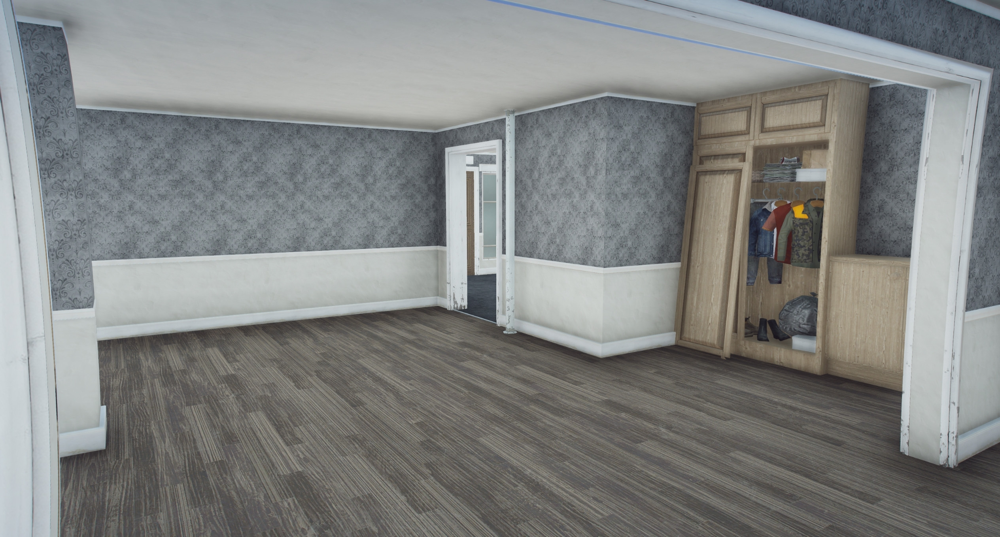
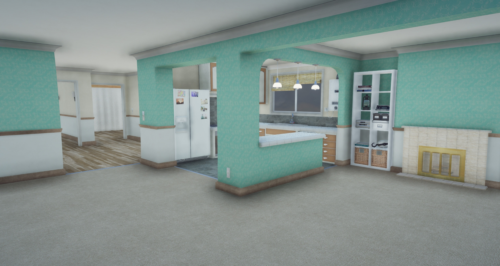
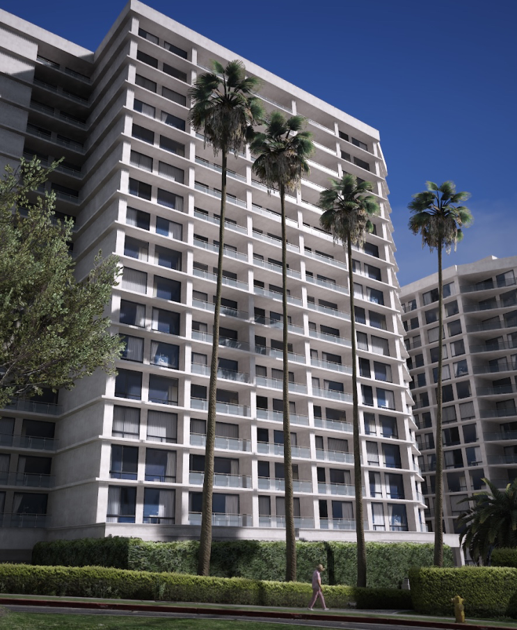
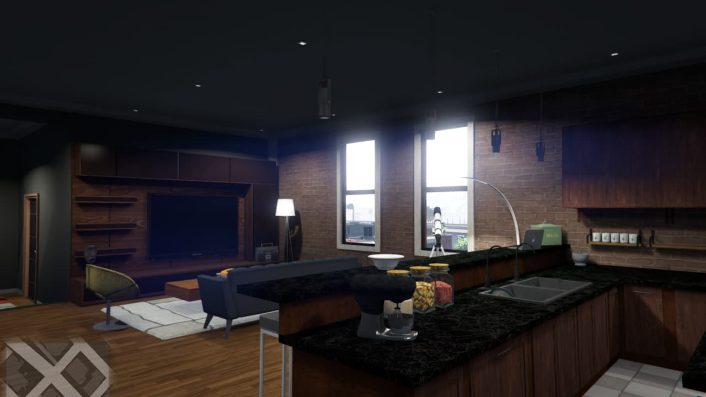
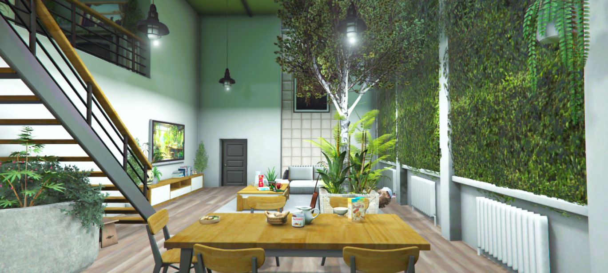

# Housing Guide

*Home isn't just where you sleep - it's where your story continues*

---

## The Dream of Ownership

> *You've been crashing on couches for weeks. Motels when you could afford them. But tonight, standing in front of YOUR door, key in hand... this is different. This is yours. You unlock it, step inside, and exhale. Finally. A place to call home.*

In Los Santos, real estate isn't just about four walls and a roof - it's about **status**, **security**, and **sanctuary**. Whether you're buying your first studio apartment or selling a Vinewood mansion, the property game has rules worth knowing.

---

## Three Paths to Property

There are three ways property changes hands in Los Santos:

| Path | Best For | Experience |
|------|----------|------------|
| **Dynasty 8 App** | Solo buyers, quick purchases | Self-service |
| **Player Realtors** | Full service, negotiation | Personalized |
| **Direct Sales** | Player-to-player deals | Flexible |

---

## Path 1: The Dynasty 8 App

*Your new life, one tap away*

### For the Independent Buyer

Don't need hand-holding? The app is your friend.

**How It Works:**
1. Open your phone (`F1`)
2. Find the Dynasty 8 Real Estate app
3. Browse available listings
4. Visit properties in person (highly recommended)
5. Purchase directly through the app

### What You'll See

| Info | Why It Matters |
|------|----------------|
| **Price** | Can you afford it? |
| **Location** | Neighborhood matters |
| **Garage Slots** | How many cars? |
| **Storage** | Stash capacity |
| **Availability** | Green = available |

> **Pro Tip:** Never buy sight unseen. The photos lie. That "cozy studio" might be a closet with a toilet.

### App Advantages

- **24/7 availability** - Browse at 3 AM if you want
- **No commission** - What you see is what you pay
- **Instant** - Keys in hand immediately
- **Private** - No awkward negotiations

---

## Path 2: Working with a Realtor

*The Realtor Experience - Let someone else do the work*

### For the Buyer

Why use a realtor? Because they know things you don't.

**What a Good Realtor Provides:**
- Insider knowledge on neighborhoods
- Access to off-market properties
- Negotiation on your behalf
- Paperwork handling
- Post-sale support

> **RP Scenario:**
> *The realtor pulls up in a convertible, sunglasses gleaming. "I've got three properties to show you today. The first one - between us - the owner's desperate to sell. Divorce. We can lowball." You raise an eyebrow. This might work out.*

### Finding a Realtor

| Method | Details |
|--------|---------|
| **Real Estate Office** | Dynasty 8 locations |
| **Word of Mouth** | Ask around |
| **Advertisements** | Check social media |
| **Cold Approach** | Visit open houses |

### The Buyer's Journey

1. **Initial Meeting** - Discuss budget, needs, preferences
2. **Property Tours** - See options in person
3. **Make an Offer** - Realtor handles negotiation
4. **Close the Deal** - Sign, pay, receive keys
5. **Move In** - Your new chapter begins

---

## Path 3: The Seller's Side

*Every property tells a story - what's yours worth?*

### Preparing to Sell

Thinking of cashing out? Here's how to maximize your return:

**Before Listing:**
| Task | Why |
|------|-----|
| **Clean the place** | First impressions matter |
| **Remove personal items** | Buyers imagine themselves there |
| **Fix obvious issues** | Don't give negotiation ammo |
| **Know your number** | What's your bottom line? |

### Selling Options

**Option A: List with Dynasty 8**
- Set your asking price
- Property appears in app
- Wait for buyers
- Accept offers through the system

**Option B: Use a Realtor**
- They market the property
- Handle showings
- Negotiate on your behalf
- Take a commission (worth it for high-value properties)

**Option C: Direct Sale**
- Find your own buyer
- Negotiate privately
- Transfer property directly
- Keep all the profit

> **RP Scenario:**
> *"Look, I'll be straight with you," the buyer says, hands in pockets. "The place needs work. Foundation's questionable. That's not a $500K house." You cross your arms. "It's Vinewood. You're not paying for the walls - you're paying for the zip code." The negotiation begins.*

### Pricing Strategy

| Strategy | When to Use |
|----------|-------------|
| **Market Value** | No rush, want fair price |
| **Above Market** | Hot neighborhood, unique features |
| **Below Market** | Need quick sale, motivated |
| **Auction Style** | Multiple interested buyers |

---

## Becoming a Realtor

*Want to be the one making deals?*

### The Realtor Life

Being a realtor isn't just about showing houses - it's about **reading people** and **closing deals**.

**What You'll Do:**
- Meet with potential buyers
- Learn their needs and budget
- Match them with properties
- Conduct showings and tours
- Negotiate between parties
- Close transactions
- Earn commission on every sale

### Getting Licensed

| Step | Details |
|------|---------|
| **Apply** | Contact Dynasty 8 management |
| **Training** | Learn the systems and properties |
| **Probation** | Shadow experienced realtors |
| **Full License** | Work independently |

### The Money

Realtors typically earn:
- **Commission** on each sale (percentage of sale price)
- **Bonuses** for high-volume months
- **Tips** from satisfied clients

> **RP Scenario:**
> *Your phone buzzes. Another lead. "I need something with ocean views, at least three garages, and privacy. Money's not an issue." You smile, pulling up your mental inventory. You know exactly the place. This commission is going to be sweet.*

### Skills of a Great Realtor

| Skill | Why It Matters |
|-------|----------------|
| **People Skills** | Read what buyers really want |
| **City Knowledge** | Know every neighborhood |
| **Negotiation** | Close deals that stick |
| **Patience** | Some buyers take forever |
| **Memory** | Remember properties and preferences |

---

## Property Types

### Apartments

*Small space, big dreams*

| Type | Price Range | Garage | Best For |
|------|-------------|--------|----------|
| **Studio** | $30K - $80K | 0-1 | Starters |
| **1 Bedroom** | $80K - $150K | 1 | Singles |
| **2 Bedroom** | $150K - $250K | 1-2 | Couples |
| **Penthouse** | $250K - $500K | 2+ | Ballers |

> *The studio is tiny. Like, really tiny. But it's yours. The mattress on the floor, the hot plate in the corner, the view of a brick wall... it's all yours. Everyone starts somewhere.*

### Houses

| Type | Price Range | Garage | Best For |
|------|-------------|--------|----------|
| **Starter Home** | $200K - $350K | 2 | First-time buyers |
| **Family Home** | $350K - $600K | 2-3 | Established players |
| **Luxury Home** | $600K - $1M | 3-4 | Success stories |

### Mansions

| Location | Price Range | Garage | Features |
|----------|-------------|--------|----------|
| **Vinewood Hills** | $1M - $3M | 4+ | Views, prestige |
| **Richman** | $2M - $5M | 6+ | Ultimate luxury |
| **Chumash** | $1M - $2M | 4+ | Beachfront living |

---

## Neighborhoods

Where you live says everything about you.

### Urban Living

| Area | Vibe | Price Level |
|------|------|-------------|
| **Downtown** | Fast-paced, central | $$$ |
| **Pillbox Hill** | Near hospital, professional | $$ |
| **Little Seoul** | Cultural, nightlife | $$ |
| **Vespucci** | Beach life, trendy | $$$ |

### Suburban Life

| Area | Vibe | Price Level |
|------|------|-------------|
| **Rockford Hills** | Wealthy, quiet | $$$$ |
| **Vinewood Hills** | Celebrity territory | $$$$ |
| **Mirror Park** | Hipster, lakeside | $$ |
| **Del Perro** | Beach access, mixed | $$ |

### Rural Retreats

| Area | Vibe | Price Level |
|------|------|-------------|
| **Paleto Bay** | Small town, peaceful | $ |
| **Grapeseed** | Farming country | $ |
| **Sandy Shores** | Desert living, wild | $ |

> **Neighborhood Tip:** Visit at different times. That quiet street at noon? Might be a party zone at midnight.

---

## Your Home Features

### Storage & Stash

*Your stuff, safe and sound*

Every property comes with:
- **Personal Stash** - Store items securely
- **Wardrobe** - Change outfits at home
- **Safe** - Extra-secure storage (some properties)

### Garage Access

Your home garage offers:
- Direct vehicle storage
- Quick access to your rides
- Protection from theft
- Varies by property size

### Customization

Make it yours:
- **Furniture placement**
- **Decoration options**
- **Lighting choices**
- **Personal touches**

---

## Security & Keys

### Protecting Your Space

| Feature | How It Works |
|---------|--------------|
| **Door Locks** | Lock when leaving |
| **Key System** | Keys in your inventory |
| **Shared Access** | Give keys to trusted players |

### Giving Keys

Trust someone? Give them access:
1. Have them present
2. Use the key-sharing option
3. They receive a copy
4. They can now enter anytime

> **Warning:** Choose wisely. Keys are trust. Betrayal happens.

> **RP Scenario:**
> *"Here." You hand over the spare key. Your partner looks at it, then at you. "You sure?" You nod. "I want you to have it. This is... this is us now." They pocket the key with a smile. "I'll try not to eat all your food."*

---

## The Transaction Process

### For Buyers

1. **Save Money** - Have funds in your bank
2. **Research** - Know what you want
3. **View Properties** - Never buy blind
4. **Make the Purchase** - Through app, realtor, or direct
5. **Receive Keys** - Appears in your inventory
6. **Move In** - It's officially yours

### For Sellers

1. **Decide to Sell** - Know your reasons
2. **Set a Price** - Be realistic
3. **List the Property** - App or realtor
4. **Show the Space** - If using realtor
5. **Accept an Offer** - Negotiate if needed
6. **Transfer Ownership** - Complete the sale
7. **Collect Payment** - Money to your account

---

## Tips for Success

### For First-Time Buyers

| Tip | Why |
|-----|-----|
| **Start small** | You can always upgrade |
| **Location over size** | Convenience matters |
| **Check garage space** | More cars need more space |
| **Keep emergency funds** | Don't spend everything |

### For Sellers

| Tip | Why |
|-----|-----|
| **Price fairly** | Overpriced properties sit |
| **Be patient** | Right buyer takes time |
| **Clean up** | First impressions sell |
| **Be flexible** | Negotiation closes deals |

### For Realtors

| Tip | Why |
|-----|-----|
| **Know your inventory** | Quick answers impress |
| **Listen more than talk** | Understand client needs |
| **Follow up** | The fortune is in the follow-up |
| **Build reputation** | Referrals are gold |

---

## The Bottom Line

> *Real estate in Los Santos isn't just about property - it's about progress. That first apartment? It's proof you made it. That house you upgrade to? It's success manifested. That mansion on the hill? That's legacy.*

Whether you're:
- **Buying** your first place
- **Selling** to move up
- **Working** as a realtor

The property game is about more than square footage. It's about **building a life**.

---

*From wherever you are now to wherever you're going - home is just the beginning.*

---

**Find your place. Make it yours.**
