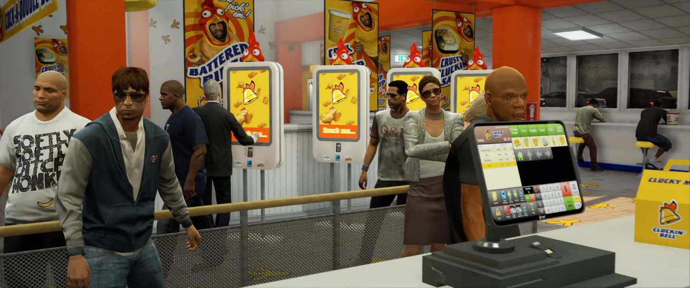
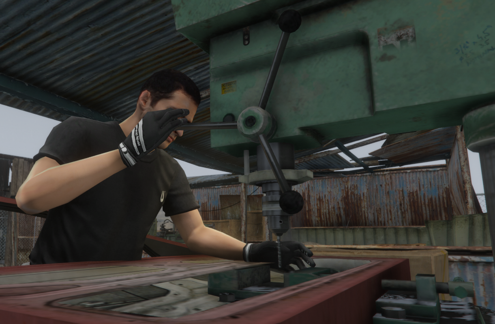

# Jobs Overview

*Over 60 careers await - from garbage collector to CEO*

DPSRP offers over 60 different careers across multiple industries. Here's a complete overview.

## How to Get a Job

1. Visit the job location or talk to the hiring NPC
2. Some jobs require interviews or applications
3. Whitelisted jobs require staff approval

## Job Categories

### Emergency Services (Whitelisted)

| Job | Department | Starting Pay |
|-----|------------|--------------|
| Police | LSPD, BCSO, SASP | Varies by rank |
| EMS | Los Santos Medical | Varies by rank |
| Fire | LSFD | Varies by rank |

*These jobs require application and training.*

### Transportation

| Job | Company | Pay Type |
|-----|---------|----------|
| Taxi Driver | Downtown Cab Co. | Per fare + tips |
| Bus Driver | LS Transit | Per route |
| Trucker | Ron Trucking | Per delivery |
| Tow Operator | Del Perro Towing | Per tow |
| Pilot | Los Santos Airlines | Per flight |
| Railroad | LS Transit Rail | Per trip |

### Automotive

| Job | Company | Specialty |
|-----|---------|-----------|
| Mechanic | LS Customs | General repairs |
| Mechanic | Auto Exotic | Luxury vehicles |
| Mechanic | Hayes Auto | Budget repairs |
| Mechanic | Beeker's | Classic cars |
| Mechanic | Benny's | Custom work |
| Car Sales | PDM | Vehicle sales |

### Food & Hospitality

*Serve up some tasty RP*

#### Fast Food
- Burger Shot (4 locations)
- Cluckin Bell
- Up-n-Atom (2 locations)
- Pizza This
- Kebab King

#### Coffee & Cafes
- Bean Machine (2 locations)
- UwU Cafe
- Cool Beans
- Central Perk
- Pond Coffee

#### Bars & Nightlife
- Bahama Mamas
- Tequi-la-la
- Vanilla Unicorn
- Malibu Club
- Bluewater Saloon
- iCentral Bar

### Government & Legal

| Job | Organization |
|-----|--------------|
| Government Official | SA Government |
| Judge | Department of Justice |
| Lawyer | Pearson Hardman Law |
| Real Estate Agent | Dynasty 8 |
| Banker | Maze Bank |

### Labor & Trade

*Skilled trades pay well*

| Job | Description |
|-----|-------------|
| Garbage Collector | Waste Management routes |
| Electrician | LS Electric Company |
| Vineyard Worker | Grape harvesting |
| Fisherman | Pier 45 operations |
| Lumberjack | Wood harvesting |
| Miner | Gold panning/mining |
| Farmer | Crop cultivation |

### Entertainment & Retail

| Job | Location |
|-----|----------|
| Casino Staff | Diamond Casino |
| Golf Club | LS Golf Club |
| Reporter | Weazel News |
| Shopkeeper | 24/7 Stores |
| Hot Dog Vendor | Street locations |

## Pay Grades

Most jobs have multiple grades with increasing pay:

| Grade | Typical Title | Pay Increase |
|-------|--------------|--------------|
| 0 | Trainee/Rookie | Base pay |
| 1 | Regular | +25% |
| 2 | Senior | +50% |
| 3 | Supervisor | +75% |
| 4+ | Manager/Boss | +100%+ |

## Boss Jobs

Some jobs have boss positions that can:
- Hire and fire employees
- Manage company funds
- Set employee grades
- Access special menus

## Starting Recommendations

**New Players:**
- Taxi, Bus, or Delivery jobs (easy start)
- Fast food (social, learn the city)
- Fishing (relaxing, good money)

**Building Capital:**
- Trucker (good solo income)
- Mechanic (tips + repairs)
- Mining/Lumberjack (consistent pay)

**Long-term Careers:**
- Police/EMS (community focused)
- Legal (RP intensive)
- Business owner (high investment)

## Tips

1. Try multiple jobs to find what you enjoy
2. Network with other players for opportunities
3. Some jobs have hidden perks (discounts, access)
4. Boss positions open up as you build reputation
