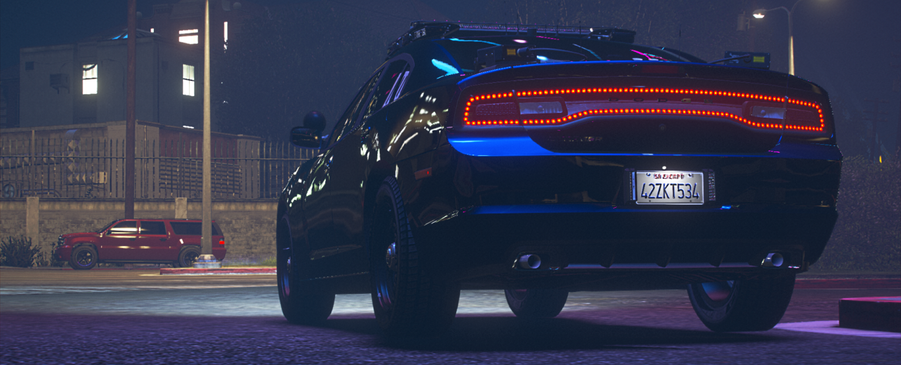
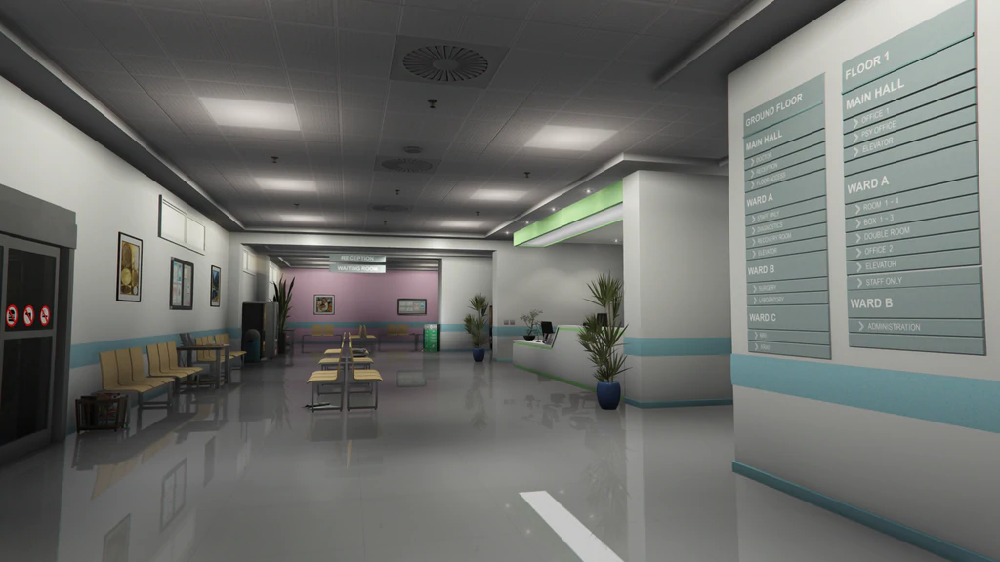
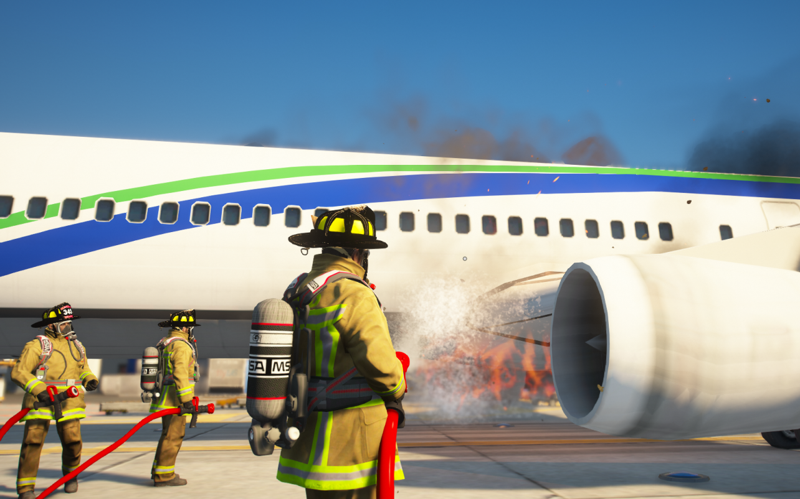

# Jobs & Careers

*From garbage man to CEO - every job tells a story*

---

## The Hustle is Real

Los Santos doesn't care about your dreams. Rent is due, food costs money, and that sweet car you've been eyeing? Yeah, that's not buying itself.

But here's the good news: **over 60 careers** await you. Some are stepping stones. Some become lifetimes. All of them pay the bills.

> **The Question Isn't *If* You'll Work...**
> *It's what you'll become.*

---

## Finding Your Path

### How to Get Hired

| Method | Best For |
|--------|----------|
| **Visit the location** | Most jobs - just show up |
| **Talk to NPCs** | Look for the interaction prompt |
| **Player businesses** | Network and ask around |
| **Whitelisted jobs** | Apply on Discord, interview required |

> **RP Scenario:**
> *You push open the door to Downtown Cab Co. A dispatcher looks up from her crossword puzzle. "You here about the job?" You nod. She slides a clipboard across the desk. "Fill this out. You got a license?" You hesitate. "...I can get one?" She laughs. "Kid, half our drivers learned on the job. Just don't hit anything expensive."*

---

## Emergency Services

*To Protect and Serve - if you can handle the pressure*

These are the **whitelisted elite** - jobs that require applications, interviews, and training. But the rewards? Respect, authority, and some of the best RP on the server.

### Law Enforcement

| Department | Jurisdiction | Vibe |
|------------|--------------|------|
| **LSPD** | Los Santos City | Urban, fast-paced |
| **BCSO** | Blaine County | Rural, close-knit |
| **SASP** | Statewide | Highways, high-speed |
| **Rangers** | State Parks | Wilderness, hunting |
| **Roxwood PD** | Roxwood | Small town |
| **Paleto PD** | Paleto Bay | Quiet... usually |
| **Sandy PD** | Sandy Shores | Desert chaos |

*Blaine County Sheriff's Office - Where the desert meets justice*

> **A Day in the Life:**
> *0300 hours. Your radio crackles. "All units, 10-80 in progress, suspect vehicle heading north on Route 68." You flip on your lights. The engine roars. Somewhere ahead, someone made a very bad decision. Time to remind them.*

### Medical Services

*Pillbox Medical Center - Where heroes wear scrubs*

| Role | What You Do |
|------|-------------|
| **Paramedic** | First response, ambulance runs |
| **EMT** | Patient transport, basic care |
| **Doctor** | Surgery, complex treatment |
| **Nurse** | Patient care, support |

> **RP Scenario:**
> *"We've got a GSW coming in, ETA two minutes!" The trauma bay erupts into motion. You snap on gloves as the ambulance backs in. The doors fly open. A pale face stares up at you. "Am I gonna die?" You grip their hand. "Not on my watch."*

### Fire Department

*LSFD - Running toward what everyone else runs from*

- Structure fires
- Vehicle accidents
- Rescue operations
- Medical backup

---

## Transportation

These are your **starter jobs** - easy to get, good money, and perfect for learning the city.

### Taxi Driver

*Every fare has a story*

**The Job:** Pick up passengers, drive them places, collect fares.

**The Reality:** You'll meet everyone. The drunk businessmen. The crying girlfriends. The suspicious guys who pay in cash and don't want to talk.

> **RP Gold:**
> *"Where to?" you ask. The woman in the back seat stares out the window. "Just... drive. Anywhere." You nod, pull away from the curb. Sometimes the destination doesn't matter.*

**Pay:** Per fare + tips
**Perks:** Great for meeting people, learning the map

### Trucker

*Long hauls, big paydays*

**The Job:** Haul cargo between locations across San Andreas.

**Routes:**
| Type | Distance | Pay |
|------|----------|-----|
| **Local** | City runs | $ |
| **Regional** | County hauls | $$ |
| **Long Haul** | Cross-state | $$$ |

> **The Open Road:**
> *Mile 47. The radio plays something old and sad. Your coffee's cold. Ahead, the sun sets over the Alamo Sea, painting the sky in oranges and purples. You've got 200 miles to go. And honestly? You're okay with that.*

### Bus Driver

**The Job:** Run fixed routes, transport citizens.

**Pro:** Consistent pay, low stress
**Con:** Same routes, same stops, same drunk guy who always falls asleep

---

## Food & Hospitality

*"Taste the Cock!" - Yes, that's really their slogan*

The service industry - where everyone starts and legends are made.

### Fast Food

| Restaurant | Locations | Known For |
|------------|-----------|-----------|
| **Burger Shot** | 4 citywide | Heart attacks |
| **Cluckin' Bell** | 2 locations | Fried everything |
| **Up-n-Atom** | 2 locations | Retro vibes |
| **Pizza This** | Downtown | Late night slices |

> **The Grind:**
> *"ORDER UP!" The kitchen's on fire - not literally, but close. Three burgers, two shakes, chicken nuggets, and some guy wants his fries "extra crispy." Your coworker calls in sick. Again. You flip the patty. This is your life now. But hey - employee discount.*

### Cafes & Coffee

*Bean Machine - Fueling bad decisions since forever*

| Spot | Vibe |
|------|------|
| **Bean Machine** | Corporate coffee |
| **UwU Cafe** | Anime aesthetic |
| **Cool Beans** | Hipster hangout |
| **Pond Coffee** | Quiet, scenic |

**Perfect for:** Chill RP, meeting people, building relationships

### Bars & Nightlife

*Where the night takes you*

| Venue | Type | Crowd |
|-------|------|-------|
| **Bahama Mamas** | Nightclub | Party people |
| **Tequi-la-la** | Rock bar | Bikers, musicians |
| **Vanilla Unicorn** | Strip club | It's complicated |
| **Blackwood Saloon** | Western bar | Cowboys, outlaws |

*Blackwood Saloon - Where the whiskey flows and secrets stay*

> **Bartender Life:**
> *The regular slides his empty glass toward you. "Another." You pour. "Rough night?" He laughs bitterly. "Rough life." You nod, wipe down the counter. Some questions don't need asking.*

---

## Labor & Trade

*Hard work, honest pay*

### Blue Collar Jobs

| Job | What You Do | Pay Style |
|-----|-------------|-----------|
| **Garbage Collector** | Route pickups | Per route |
| **Electrician** | Repair, install | Per job |
| **Lumberjack** | Harvest wood | Per load |
| **Miner** | Extract ore | Per haul |
| **Farmer** | Grow, harvest | Per crop |
| **Fisherman** | Cast, catch, sell | Per catch |

> **The Simple Life:**
> *Dawn breaks over the vineyard. You've been here since 5 AM, hands stained purple from the grapes. Your back aches. But there's something honest about this work - something real. No politics. No drama. Just you, the vines, and the sunrise.*

---

## Skilled Trades

### Mechanic

*Every car tells a story - your job is to keep it running*

| Shop | Specialty | Clientele |
|------|-----------|-----------|
| **LS Customs** | General | Everyone |
| **Auto Exotic** | Luxury | High-end |
| **Hayes Auto** | Budget | Working class |
| **Beeker's** | Classics | Collectors |
| **Benny's** | Custom | Lowriders |

**What You'll Do:**
- Diagnose problems
- Perform repairs
- Install upgrades
- Deal with impatient customers

> **Under the Hood:**
> *"It's making a noise." You stare at the customer. "What kind of noise?" They shrug. "A... bad one?" You sigh, pop the hood. This is going to be a long day.*

---

## Government & Legal

### The Power Players

| Role | What You Do |
|------|-------------|
| **Mayor** | Run the city |
| **Judge** | Decide fates |
| **Lawyer** | Argue for pay |
| **City Hall Staff** | Keep things moving |

These jobs mean **influence**. They also mean responsibility. And drama. Lots of drama.

---

## Career Progression

Most jobs have ranks. Move up, earn more:

| Grade | Title | Pay Boost |
|-------|-------|-----------|
| 0 | Trainee | Base |
| 1 | Regular | +25% |
| 2 | Senior | +50% |
| 3 | Supervisor | +75% |
| 4+ | Manager/Boss | +100%+ |

> **The Climb:**
> *Two years ago, you were flipping burgers. Now you're running the store. The new kid messes up an order and you remember - that was you once. "Hey," you say, walking over. "Let me show you a trick..."*

---

## Finding Your Fit

### Just Starting Out?

Try these first:
- **Taxi** - Learn the city, meet people
- **Fast Food** - Easy money, social RP
- **Fishing** - Relaxing, good income

### Building Capital?

Graduate to:
- **Trucker** - Solid solo income
- **Mechanic** - Tips + regular work
- **Mining/Lumber** - Consistent grind

### Long-Term Career?

Aim for:
- **Police/EMS** - Community impact
- **Legal** - High-stakes RP
- **Business Owner** - Build an empire

---

## The Real Secret

Here's what nobody tells you:

**The job doesn't matter. The story does.**

The best mechanic RP isn't about fixing cars - it's about the regular customer whose car keeps breaking down because they can't afford a new one. It's about the late-night tow where you find something in the trunk you shouldn't have seen.

The best cop RP isn't about arrests - it's about the kid you let go with a warning who shows up years later to thank you.

**Every job is just a setting. You bring the story.**

---

*The city is full of jobs. But there's only one career that matters: yours.*

---

**Now get out there and earn.**
