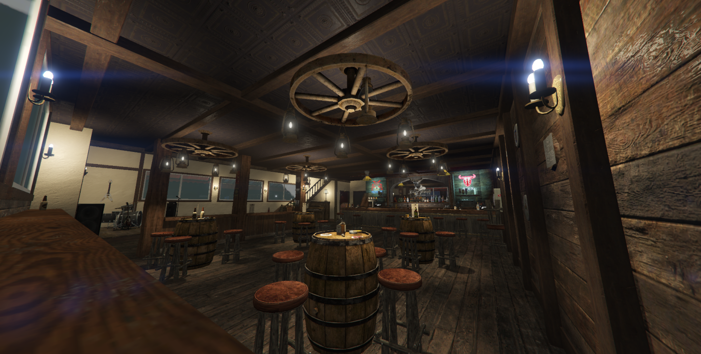
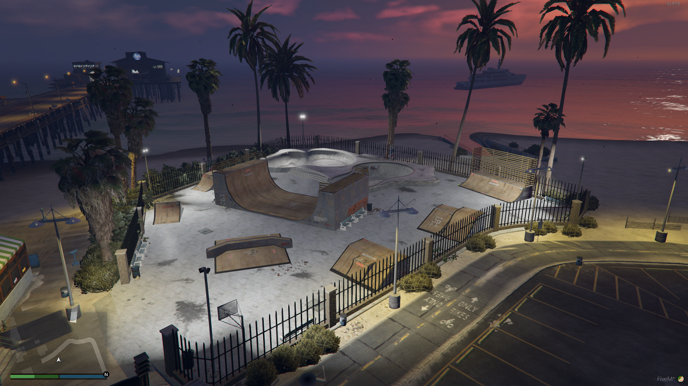

# Activities & Entertainment

*Life isn't all work and crime - sometimes you just need to have fun*

---

## Why Activities Matter

> *"All work and no play makes your character boring as hell."*

The best roleplayers know: **downtime creates depth**. The moments between the action - grabbing drinks with friends, hitting the casino, watching the sunset - that's where characters become real.

---

## Nightlife

When the sun goes down, Los Santos comes alive.

### Nightclubs

*Bahama Mamas West - Where the party never stops*

| Club | Vibe | Location |
|------|------|----------|
| **Bahama Mamas** | Beach party, EDM | Del Perro |
| **Galaxy Nightclub** | VIP experience | Downtown |
| **Vanilla Unicorn** | Adult entertainment | Strawberry |

**What To Expect:**
- Live DJs
- Dance floors
- VIP sections
- Drinks (lots of them)

> **RP Scenario:**
> *The bass drops. Bodies move. Lights flash. You're three drinks deep, dancing with a stranger whose name you've already forgotten. Someone bumps into you, spills your drink. "Hey!" But they're already gone, swallowed by the crowd. You laugh. Who cares. Tonight, nothing matters but the music.*

### Bars & Saloons

*Blackwood Saloon - Where stories get told*

| Bar | Style | Crowd |
|-----|-------|-------|
| **Blackwood Saloon** | Western | Cowboys, outlaws |
| **Tequi-la-la** | Rock | Bikers, musicians |
| **Bluewater Saloon** | Dive bar | Regulars |

**Perfect For:**
- Quiet conversations
- Meeting contacts
- Drowning sorrows
- Playing pool, darts

> **The Regular:**
> *Same seat. Same drink. The bartender doesn't even ask anymore. "Rough day?" she asks. You grunt. She pours. Some days, that's all the conversation you need.*

---

## The Diamond Casino

*The Diamond - Where fortunes are made and lost*

The ultimate entertainment destination.

### Games of Chance

*Place your bets*

| Game | Risk Level | House Edge |
|------|------------|------------|
| **Slots** | Low stakes | High |
| **Blackjack** | Skill-based | Medium |
| **Roulette** | Pure luck | Medium |
| **Poker** | High skill | Low |

> **The High Roller:**
> *Red or black. Everything rides on this spin. The ball bounces. Your heart stops. It lands. Black. You exhale. Double or nothing? The devil on your shoulder whispers. "One more spin..."*

### Casino Amenities

- **Penthouse Suites** - VIP living
- **Restaurant** - Fine dining
- **Gift Shop** - Exclusive merch
- **Valet** - Park your ride in style

**Pro Tips:**
- Set a limit before you walk in
- The house always wins eventually
- Best RP happens at the bar, not the tables
- Dress the part

---

## Sports & Recreation

### Golf

*Los Santos Golf Club - Where deals get done*

**18 holes** of pristine greens with stunning views.

| What | Details |
|------|---------|
| **Location** | Richman |
| **Cost** | Club membership or guest fee |
| **Gear** | Rentals available |

> **The Back Nine:**
> *"So about that deal..." Your business partner lines up his putt. "What deal?" he asks, not looking up. The ball rolls. Misses by inches. He swears. "The one we discussed." He finally looks at you. "Ah. That deal." Some negotiations happen in boardrooms. The real ones? They happen on the 9th hole.*

### Bowling

Full bowling alleys with:
- Multiple lanes
- Shoe rentals
- Snack bar
- League play

**Perfect Date Night RP.**

### Pool & Darts

Found in most bars:
- 8-ball and 9-ball
- Standard 501 darts
- Side bets (careful)

> **The Hustle:**
> *"I'm not very good," you say, missing the shot on purpose. The guy across the table grins. "Double or nothing?" You smile back. "Sure." Poor bastard.*

---

## Beach Life

*Vespucci Beach - Sun, sand, and stories*

### Vespucci Beach

| Activity | Location |
|----------|----------|
| **Muscle Beach** | Outdoor gym |
| **Boardwalk** | Vendors, performers |
| **Skate Park** | Show off tricks |
| **Volleyball** | Pickup games |

### Beach Activities

- **Jetski Rentals** - $500 deposit
- **Surfing** - Grab a board and hit the waves
- **Sunbathing** - Use towel items
- **Swimming** - Natural at any water body

> **Beach Day:**
> *Salt air. Warm sand. The waves crash rhythmically. For a moment, you forget about the job, the drama, the bills. Just you, the sun, and the ocean. A kid runs past, kicking sand onto your towel. Okay. Moment over. But it was nice while it lasted.*

### Mirror Park

Quieter alternative to the beach:
- **Lake activities** - Jetski, swimming
- **Yoga mats** - Reduce stress
- **Campfire** - Night gatherings
- **Live music** - Guitars, boomboxes

---

## Dining Out

### Fast Food

*Burger Shot - "Shooting Flavor Into Your Mouth"*

| Chain | Specialty |
|-------|-----------|
| **Burger Shot** | Burgers (obviously) |
| **Cluckin' Bell** | Chicken everything |
| **Up-n-Atom** | Retro diner vibes |

### Cafes

*Where coffee meets conversation*

| Cafe | Vibe |
|------|------|
| **Bean Machine** | Corporate, busy |
| **UwU Cafe** | Anime themed |
| **Cool Beans** | Hipster hangout |
| **Pond Coffee** | Scenic, quiet |

> **Coffee Date:**
> *"So... this is awkward." She laughs. It is awkward. You met online, and the photos were... generous. But she's nice. And the coffee's good. "Tell me about yourself," you say. She talks. You listen. Maybe this isn't so bad after all.*

### Fine Dining

For special occasions:
- **The Vinewood** - Celebrity spotting
- **Bahama Mamas Restaurant** - Beachfront elegance
- **Casino Restaurant** - High roller vibes

---

## Gaming & Arcades

*Classic games, classic fun*

### The Arcade

| Features | Details |
|----------|---------|
| **Classic Cabinets** | Pac-Man, Space Invaders |
| **Racing Games** | Compete with friends |
| **Skill Games** | Win tickets for prizes |
| **Atmosphere** | 80s nostalgia |

**Perfect for:**
- Casual hangouts
- First dates
- Killing time
- Competitive rivalries

> **High Score:**
> *Your initials flash on the screen: AAA. First place. The kid next to you stares. "How'd you do that?" You crack your knuckles. "Practice, kid. Lots of practice." You don't mention the three hours you've been here.*

---

## Outdoor Adventures

### Fishing

*The peaceful life*

**Locations:**
- Pier 45
- Alamo Sea
- Pacific Ocean
- Various lakes

**What You Need:**
- Fishing rod
- Bait
- Patience

> **The One That Got Away:**
> *The line goes taut. Your rod bends. "I got one!" The reel screams. You fight it. Sweat drips. And then... snap. The line goes slack. It's gone. You stare at the water. "Next time," you mutter. It's always next time.*

### Camping

With rcore_camping:
- Set up tents
- Build campfires
- Cook food
- Stargaze

### Hiking

Mountain trails offer:
- Scenic views
- Photography spots
- Peaceful escape
- Hidden locations

---

## Unique Experiences

### Yoga & Meditation

Beach yoga spots reduce stress:
- Find yoga mats at parks
- Follow the exercises
- Clear your mind
- Health benefits

### Street Performance

Become a busker:
- Play instruments
- Perform acts
- Collect tips
- Build a following

### Photography

Use the in-game camera:
- Capture moments
- Portrait sessions
- Scenic shots
- Create memories

---

## Social Hotspots

### Best Places to Meet People

| Location | Type of People | Best Time |
|----------|----------------|-----------|
| **Legion Square** | Everyone | Anytime |
| **Casino** | High rollers | Night |
| **Beach** | Casual | Day |
| **Bars** | Regulars | Evening |
| **Clubs** | Party crowd | Late night |

> **Making Friends:**
> *The guy next to you at the bar nods. "Rough night?" You shrug. "Could be worse." He laughs. "Amen to that." He offers a hand. "Marcus." You shake it. "Just moved here," you admit. "Don't know anyone." Marcus grins. "Well, now you know me." Sometimes that's how it starts.*

---

## The Art of Downtime

Here's the secret to great roleplay:

**The best moments aren't scripted.**

They happen at 3 AM at a bar when someone starts telling their life story. They happen on a fishing pier when two strangers bond over bad luck. They happen at the casino when you meet your future partner-in-crime.

Activities aren't just things to do. They're **opportunities** to create connections.

> **The Philosophy:**
> *"Why are you always here?" the bartender asks. You swirl your drink. "Because here, I'm not a mechanic or a criminal or whatever else I gotta be. Here, I'm just... me." She nods like she understands. Maybe she does.*

---

*The city offers endless ways to spend your time. The question is: who will you spend it with?*

---

**Now go have some fun.**
