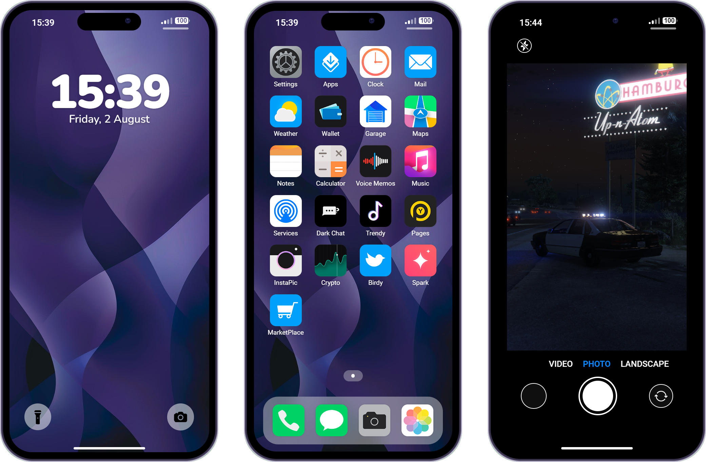

# Phone Guide

*Your pocket-sized gateway to everything Los Santos*

---

## Your Digital Lifeline

> *The phone buzzes. Unknown number. You hesitate - could be a job, could be a threat, could be the woman from the bar last night. You answer. "We need to talk." The voice is familiar. Your heart races. In Los Santos, one phone call can change everything.*

Your phone isn't just a device - it's your connection to the world. Calls, texts, banking, navigation, social media, emergency services... everything runs through that screen in your pocket.

---

## Getting Started

### Opening Your Phone

| Action | Key |
|--------|-----|
| **Open Phone** | `F1` |
| **Close Phone** | `F1` or `ESC` |
| **Navigate** | Mouse click or scroll |

### The Home Screen

Your phone organizes everything into apps:

| App Category | What's Inside |
|--------------|---------------|
| **Communication** | Calls, Texts, Contacts |
| **Social** | Twitter, Instagram |
| **Finance** | Banking, Crypto |
| **Utilities** | Maps, Camera, Settings |
| **Services** | Taxi, Mechanic, 911 |

---

## Making Calls

*Conversations that shape your story*

### How to Call

1. Open your phone (`F1`)
2. Tap the **Phone** app
3. Either:
   - Dial a number directly
   - Select from contacts
   - Use recent calls
4. Wait for answer
5. Talk using voice chat
6. Hang up when done

### Call Tips

| Tip | Why |
|-----|-----|
| **Save important numbers** | Quick access in emergencies |
| **Answer unknown calls** | Could be opportunities |
| **Private location for calls** | Some conversations need privacy |
| **Check voicemail** | Messages get left |

> **RP Scenario:**
> *"Meet me at the pier. Alone." The line goes dead. You stare at the phone. Who was that? The voice was disguised. Could be a setup. Could be the answer you've been looking for. Either way, you're going to that pier.*

---

## Text Messages

### Sending Texts

1. Open **Messages** app
2. Start new conversation or select existing
3. Type your message
4. Hit send

### Why Texting Matters

| Use Case | Example |
|----------|---------|
| **Discrete communication** | When you can't talk |
| **Record keeping** | Proof of agreements |
| **Group coordination** | Team planning |
| **Romance** | Building relationships |

> **The Screenshot:**
> *"I never said that." He's lying. You knew he would. So you screenshot the conversation before meeting. You pull out your phone, show him his own words. His face falls. "Okay, fine. But—" No buts. The receipts don't lie.*

---

## Contacts

### Managing Your People

Your contacts list is your network:

| Feature | Use |
|---------|-----|
| **Add Contact** | Save new numbers |
| **Edit Contact** | Update information |
| **Delete Contact** | Remove old connections |
| **Favorites** | Quick-access important people |

### Organizing Contacts

Smart players organize:
- **Work** - Bosses, colleagues
- **Personal** - Friends, family
- **Business** - Clients, partners
- **Emergency** - Lawyer, doctor

> **The Contact List:**
> *You scroll through your phone. 147 contacts. Half are people you don't remember meeting. A third are from jobs that didn't pan out. But those last few - the ones you actually call - those are the people who matter.*

---

## Social Media

### Twitter / Birdy

Public posts that everyone can see:

| Use | Purpose |
|-----|---------|
| **Announcements** | Tell the city something |
| **Business Promo** | Advertise services |
| **Updates** | Share your life |
| **Finding People** | Public connections |

> **Going Viral:**
> *"JUST GOT PROMOTED TO DETECTIVE" you type, proud. Within minutes, the replies flood in. Congratulations. Jokes. And one message from someone you arrested last month: "Watch your back, pig." Fame comes with a price.*

### Instagram / Instapic

Photo sharing for the visual moments:
- Share experiences
- Build a following
- Document your life
- Connect through images

---

## Finance Apps

### Banking

Full banking access from your phone:
- Check balance
- Transfer money
- View transactions
- Pay bills

### Crypto

For the financially adventurous:
- Trade cryptocurrency
- Track prices
- Manage portfolio

> **Pro Tip:** Never show your banking screen in public. People watch. People remember.

---

## Utilities

### Maps & GPS

*Never get lost*

Your navigation system:

| Feature | Use |
|---------|-----|
| **Set Waypoint** | Mark any location |
| **Saved Locations** | Quick access to favorites |
| **Current Location** | See where you are |
| **Directions** | Route guidance |

### Camera

Capture the moment:
- Take photos
- Record videos
- Save to gallery
- Share with others

### Gallery

Your photo collection:
- View past photos
- Organize memories
- Share images
- Delete what you don't need

---

## Emergency Services

### 911

When seconds matter:

| Emergency | Who Responds |
|-----------|--------------|
| **Crime in Progress** | Police |
| **Medical Emergency** | EMS/Ambulance |
| **Fire** | Fire Department |
| **All of the Above** | Multiple units |

### How to Call 911

1. Open phone
2. Dial 911 (or use emergency app)
3. Describe your emergency **clearly**
4. Give your **exact location**
5. Stay on the line if possible
6. Follow dispatcher instructions

> **RP Scenario:**
> *"911, what's your emergency?" Your hands shake. Blood everywhere. Your friend on the ground. "There's been a shooting. Vespucci Beach, near the pier. My friend, he's—" You choke on the words. "Help is on the way. Stay on the line. Is he breathing?" You look down. Is he?*

### Specific Department Calls

| Service | When to Call |
|---------|--------------|
| **Police (non-emergency)** | Reports, questions |
| **EMS** | Medical transport |
| **Mechanic** | Vehicle assistance |
| **Taxi** | Need a ride |
| **Tow** | Vehicle recovery |

---

## Job-Specific Features

Some jobs unlock special phone features:

### Taxi Drivers
- Receive fare requests
- Accept/decline rides
- See passenger location
- Track earnings

### Mechanics
- Service call alerts
- Customer location
- Job details
- Payment tracking

### Delivery Workers
- Order notifications
- Delivery addresses
- Time tracking
- Route optimization

---

## Phone Settings

### Customization Options

| Setting | What It Does |
|---------|--------------|
| **Ringtone** | Change notification sounds |
| **Background** | Customize home screen |
| **Notifications** | Control alerts |
| **Airplane Mode** | Go dark when needed |

> **Going Dark:**
> *You flip to airplane mode. No calls. No texts. No location. For the next hour, you don't exist. The job requires it. When you're done, you'll turn it back on. But right now? You're a ghost.*

---

## Power User Tips

### Communication
1. **Save everyone** - You never know when you'll need a contact
2. **Screenshot important conversations** - Proof matters
3. **Check messages regularly** - Don't miss opportunities
4. **Voice calls for sensitive info** - Texts can be forwarded

### Organization
1. **Clear old messages** - Keep things clean
2. **Organize contacts** - Find people fast
3. **Use favorites** - Quick access to important people
4. **Regular backups** - Don't lose connections

### Safety
1. **Private for calls** - Find quiet spots
2. **Watch for eavesdroppers** - People listen
3. **Secure your phone** - Don't let others browse
4. **911 on speed dial** - Always accessible

---

## Common Mistakes

| Mistake | Consequence |
|---------|-------------|
| Ignoring calls | Miss opportunities |
| Texting while driving | Crash |
| Public banking | Get robbed |
| Not saving contacts | "Who was that?" |
| Forgetting to charge | Dead at worst time |

---

## The Phone Is Power

> *In Los Santos, information is currency. Your phone is your bank. Every contact is an asset. Every message is potential leverage. Every call is a door opening - or closing. Master your phone, master your life.*

The players who succeed aren't just good at their jobs. They're good at staying connected. They answer calls. They return texts. They build networks one conversation at a time.

---

*One device. Infinite possibilities.*

---

**Stay connected. Stay informed. Stay ahead.**
