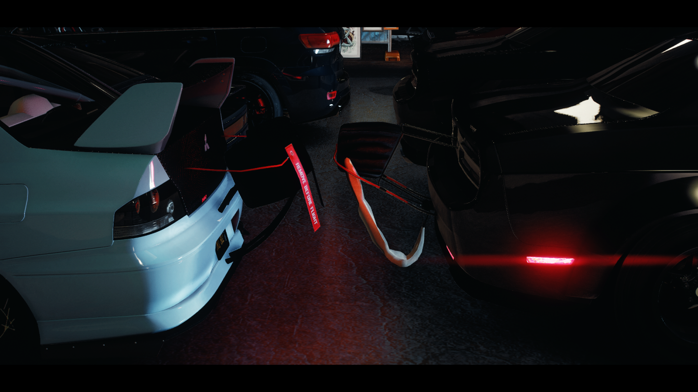
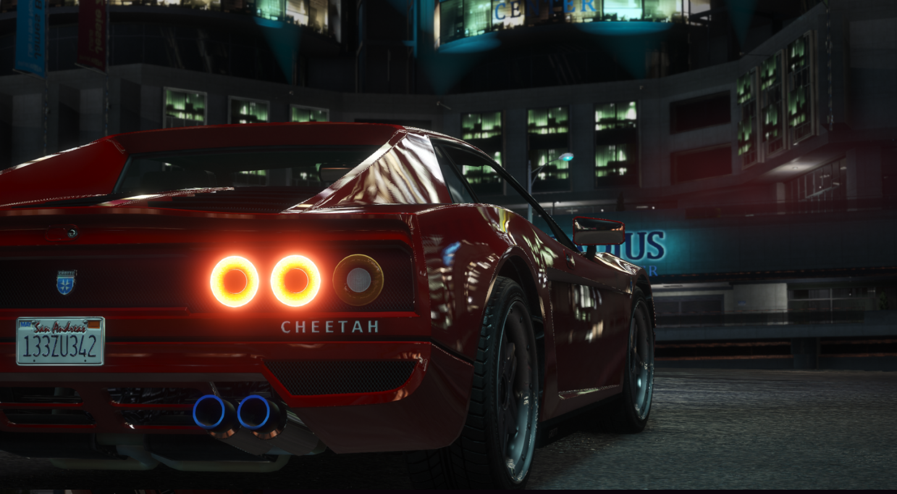

# Racing Guide

*When the sun goes down, the real racing begins*

---

## The Underground Scene

> *2 AM. Empty streets. Your hands grip the wheel as engines rumble around you. Someone walks to the middle of the road, arms raised. "On my signal!" The crowd goes quiet. Your foot hovers over the gas. This is what you've trained for. This is everything. Arms drop. FLOOR IT.*

Los Santos has a thriving underground racing scene - from organized drag strips to illegal street races through downtown. If you've got the car and the courage, there's always someone willing to race.

---

## Racing Systems

### Three Ways to Race

| Type | Style | Risk Level |
|------|-------|------------|
| **Drag Racing** | Quarter-mile straight shots | Low (legal strip) |
| **Street Racing** | Checkpoint races through the city | High (illegal) |
| **RC Racing** | Miniature car competitions | None (just fun) |

---

## Drag Racing

*Pure acceleration. No corners. No excuses.*

### What It Is

Quarter-mile straight-line racing. Two cars, one finish line, no turns. Pure power.

### The Drag Strip

**Location:** LSIA Airport runway area
- Official strip with timing equipment
- Safe, legal competition
- Recorded times and leaderboards

### How to Race

1. **Arrive** - Drive to the drag strip
2. **Queue Up** - Join the line or challenge someone
3. **Stage** - Position at the starting line
4. **Wait** - Watch the lights
5. **Launch** - GREEN means GO
6. **Finish** - First across wins

> **RP Scenario:**
> *The Christmas tree lights count down. Yellow. Yellow. Yellow. You watch, foot ready. GREEN! Tires scream. G-force pins you to the seat. In four seconds, it's over. You glance at the time board. 9.8 seconds. Personal best. The crowd cheers.*

### Staging

| Stage | What Happens |
|-------|--------------|
| **Pre-Stage** | Approaching the line |
| **Staged** | Positioned, ready |
| **Lights** | Yellow countdown |
| **Launch** | Green = GO |

### Reaction Time

Your reaction matters:
- **Perfect:** 0.000 seconds
- **Good:** Under 0.100
- **Slow:** Over 0.200
- **DQ:** Red light (too early)

### Vehicle Classes

| Class | What Qualifies |
|-------|----------------|
| **Street** | Mostly stock vehicles |
| **Sport** | Sports cars |
| **Super** | High-end supercars |
| **Tuned** | Modified builds |
| **Open** | Anything goes |

### Drag Tuning Tips

| Upgrade | Why It Matters |
|---------|----------------|
| **Engine** | Maximum power |
| **Transmission** | Quick shifts |
| **Turbo** | Extra boost |
| **Weight Reduction** | Faster acceleration |

---

## Street Racing

*The streets of Los Santos - your racetrack*

### The Underground

Organized illegal racing through city streets. Checkpoints. Betting. Police. Everything that makes it dangerous makes it exciting.

### Finding Races

Races appear as blips on your map. Or know the right people.

### Commands

| Command | What It Does |
|---------|--------------|
| `/createrace [length] [category] [bet]` | Create a new race |
| `/startrace` | Start immediately |
| `/stoprace` | Cancel the race |
| `/racestats` | View your statistics |
| `/racename [name]` | Set your racer name |
| `/raceready` | Signal ready to race |
| `/racecategory` | Check your car's class |

### Creating a Race

1. Position where you want to start
2. Use the create command:
   - **Length:** `short` (15 checkpoints), `normal` (40), `long` (80)
   - **Category:** `a`, `b`, `c`, or `d` (vehicle class)
   - **Bet:** Entry fee amount
3. Race generates automatically
4. Blip appears for other players

> **RP Scenario:**
> *"Fifty thousand. Winner takes all." You count the bills, add them to the pot. Twelve racers. $600,000 in the middle. The organizer nods. "Checkpoints are live. First to finish, don't get caught." You slide into your seat. This is either going to be your best night or your worst.*

*Late night meets in Koreatown*

### Vehicle Categories

| Category | Description | Examples |
|----------|-------------|----------|
| **A** | Top-tier supercars | Zentorno, T20, Krieger |
| **B** | Sports cars | Elegy, Jester, Comet |
| **C** | Muscle/Tuners | Dominator, Sultan RS |
| **D** | Economy/Compacts | Blista, Issi, Futo |

### Race Features

| Feature | How It Works |
|---------|--------------|
| **Slipstreaming** | Draft behind cars for speed boost |
| **Checkpoints** | Follow the markers |
| **Timer** | Beat the clock |
| **ELO Rating** | Win/lose rating based on performance |
| **Prize Pool** | Bet money goes to winners |

### Race Lengths

| Length | Checkpoints | Time After 1st Finishes |
|--------|-------------|-------------------------|
| **Short** | 15 | 30 seconds |
| **Normal** | 40 | 60 seconds |
| **Long** | 80 | 90 seconds |

### The Police Problem

**Street racing is illegal.** If cops show up:

| Option | Risk |
|--------|------|
| **Outrun them** | High, but keeps the race going |
| **Scatter** | Medium, everyone for themselves |
| **Pull over** | Low risk, guaranteed ticket |

> **The Chase:**
> *Sirens behind you. Lights in your mirror. "Cops!" someone yells on the radio. You're in third place, two checkpoints from the finish. Do you stop? Do you run? Decision time. You floor it. The finish line is RIGHT THERE...*

---

## RC Racing

*Big thrills, small cars*

### What It Is

Radio-controlled car racing on miniature tracks. No police. No wrecks. Just pure racing fun.

### Getting Started

1. Purchase an RC car from the appropriate shop
2. Find an RC track location
3. Deploy your car
4. Race other players

### RC Car Types

| Type | Best For |
|------|----------|
| **Buggy** | All-terrain racing |
| **On-Road** | Fast paved tracks |
| **Monster** | Jumps and stunts |
| **Drift** | Sliding style |

### Controls

| Key | Action |
|-----|--------|
| `W/S` | Throttle/Brake |
| `A/D` | Steering |
| `Space` | Reset position |
| `E` | Exit RC mode |

---

## Building Your Racer

*The machine matters*

### Basic Requirements

Before you race:
- Reliable vehicle (won't break mid-race)
- Full fuel tank
- Good condition
- Insurance (recommended)

### Performance Upgrades

| Part | Racing Benefit |
|------|----------------|
| **Engine** | More power |
| **Transmission** | Better acceleration |
| **Brakes** | Shorter stopping distance |
| **Suspension** | Improved handling |
| **Turbo** | Boost power |
| **Tires** | Better grip |

### Tuning for Your Style

| Race Type | Priority Upgrades |
|-----------|-------------------|
| **Drag** | Engine, turbo, transmission |
| **Street** | All-around, balanced |
| **Circuit** | Brakes, suspension, tires |

> **The Build:**
> *"What are you looking for?" The mechanic wipes grease on his overalls. "Pure straight-line speed," you say. He nods. "Engine work. Turbo kit. Weight reduction. About fifty thousand when we're done." You think of the drag times. Worth every penny.*

---

## Racing Crews

### Why Join a Crew?

| Benefit | What It Means |
|---------|---------------|
| **Private Races** | Exclusive events |
| **Shared Knowledge** | Tuning tips, track secrets |
| **Protection** | Safety in numbers |
| **Reputation** | Your crew's name carries weight |

### Finding a Crew

- Hang around racing spots
- Prove yourself in races
- Get invited to the inner circle

> **The Invitation:**
> *"You're fast." The guy leans against your car, arms crossed. "We've been watching. You interested in running with a real crew?" You look around - three other cars, engines idling, drivers waiting. This is what you've been working toward. "I'm listening."*

---

## Racing Etiquette

### The Code

| Do | Don't |
|----|-------|
| Race clean | Ram opponents |
| Honor bets | Welch on money |
| Respect winners | Make excuses |
| Help newcomers | Gate-keep |
| Be graceful in loss | Rage quit |

### Clean Racing

What counts as clean:
- No intentional contact
- No blocking when being passed
- No cutting corners
- No exploiting glitches

> **The Clean Pass:**
> *He's on your bumper. You see the move coming - inside on the next corner. You hold your line, leave room. He takes it cleanly, pulls ahead. Fair. You'll get him on the straight.*

---

## Tips for Victory

### General Racing

1. **Know your car** - Understand its limits
2. **Learn the route** - Familiarity wins
3. **Smooth inputs** - Jerky driving is slow driving
4. **Brake early** - Speed comes from corner exit
5. **Watch others** - Learn from faster drivers

### Drag Specific

1. **Perfect your launch** - Reaction time matters
2. **Stay straight** - No drifting off course
3. **Shift timing** - Hit optimal RPM points
4. **Reduce weight** - Every pound counts

### Street Racing

1. **Scout the course** - Drive it before race day
2. **Know escape routes** - In case of cops
3. **Bring backup money** - If you lose the bet
4. **Trust your crew** - They watch your back

---

## The Racing Life

> *It's not about the money. Not really. The bets, the prizes - that's just how you keep score. It's about the moment. That second when everything's perfect - you, the car, the road. When you hit that apex just right, feel the grip, power through. That's what you chase. That's why you race.*

The best racers in Los Santos aren't just fast. They're smart. They know their cars. They respect the competition. They race clean and win clean.

---

**Now get out there and prove yourself.**
