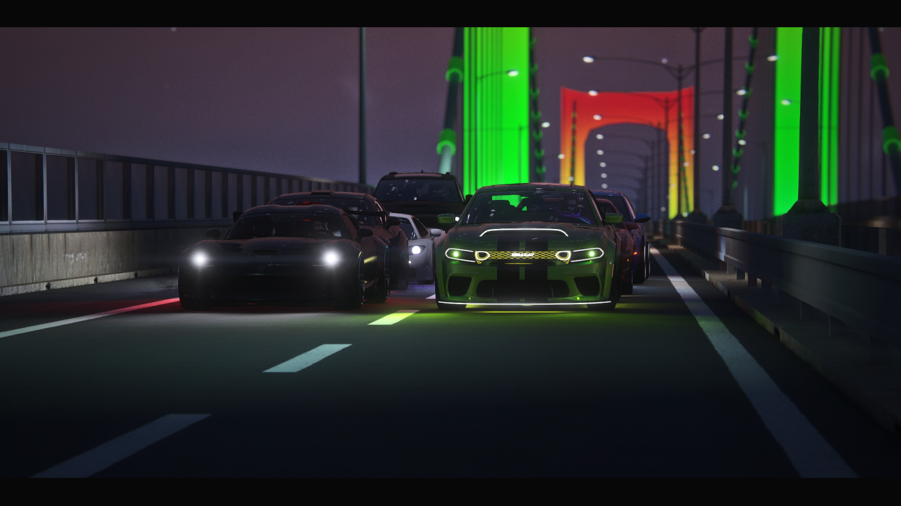
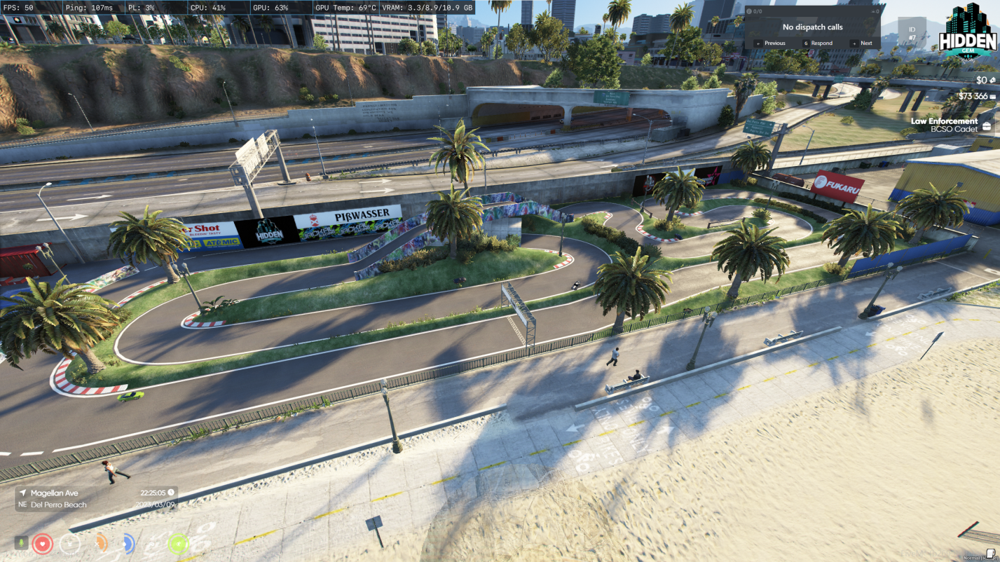
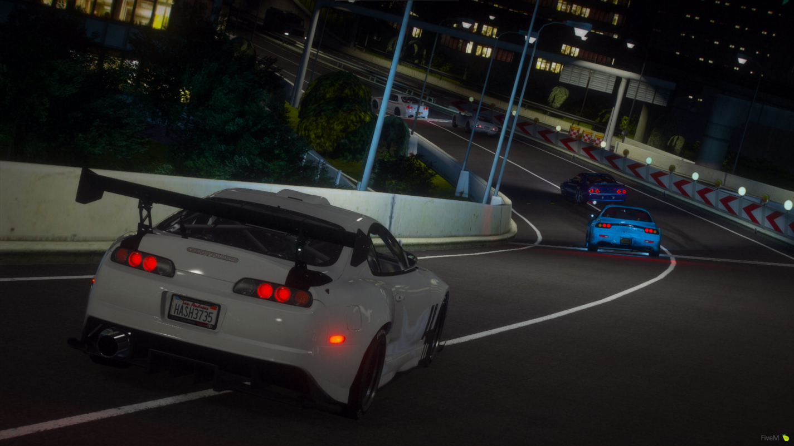
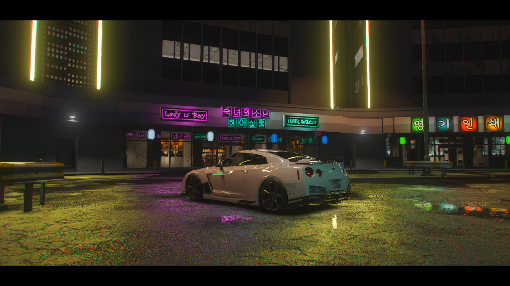

# Racing Guide

Complete guide to racing on DPSRP - a car enthusiast's server!

*Underground street racing in Los Santos*

## Overview

DPSRP features multiple racing systems:
- **rcore_dragrace** - Drag strip racing
- **Pata_RcRace** - RC car racing
- Street racing scene

---

## Drag Racing (rcore_dragrace)

### What is Drag Racing?
Quarter-mile straight-line racing. Pure acceleration competition.

### Location
- **Drag Strip:** LSIA Airport runway area
- Look for the starting line markers

### How to Race

#### Starting a Race
1. Drive to the drag strip
2. Position at starting line
3. Challenge another player or join queue
4. Wait for countdown
5. Launch when lights go green!

#### Race Controls
| Key | Action |
|-----|--------|
| W | Accelerate |
| S | Brake |
| Shift | Manual shifting (if enabled) |

### Staging
1. **Pre-Stage** - Approach starting line
2. **Stage** - At the line, ready
3. **Launch** - When lights go green

### Reaction Time
- Yellow lights count down
- Green = GO
- Red = False start (DQ)
- Perfect launch = 0.000 reaction time

### Winning
- First across finish line wins
- Best of 3 for tournaments
- Times recorded to leaderboard

### Vehicle Classes
| Class | Description |
|-------|-------------|
| Street | Stock vehicles |
| Sport | Sports cars |
| Super | Supercars |
| Tuned | Modified vehicles |
| Open | Anything goes |

### Tuning for Drag
Best upgrades for drag racing:
- **Engine** - Maximum power
- **Transmission** - Quick shifts
- **Turbo** - Extra boost
- **Weight reduction** - Faster acceleration

---

## RC Racing (Pata_RcRace)

*RC Racing track - miniature thrills, maximum fun!*

### What is RC Racing?
Radio-controlled car racing on miniature tracks!

### Getting Started
1. Purchase RC car from appropriate shop
2. Find an RC track location
3. Deploy your RC car
4. Race other players

### RC Car Types
| Type | Characteristic |
|------|----------------|
| Buggy | All-terrain |
| On-Road | Fast on pavement |
| Monster | Big tires, jumping |
| Drift | Sliding style |

### Tracks
- Various tracks around the map
- Indoor and outdoor
- Different difficulty levels

### Controls
| Key | Action |
|-----|--------|
| W/S | Throttle/Brake |
| A/D | Steering |
| Space | Reset position |
| E | Exit RC mode |

### Racing Tips
- Learn the track layout
- Don't overcorrect steering
- Brake before turns, accelerate out
- Watch your battery/fuel

---

## Street Racing (rcore_races)

*JDM culture runs deep in Los Santos*

### Overview
Organized street racing with checkpoints, betting, and leaderboards.

*Late night meets in Koreatown*

### Commands
| Command | Description |
|---------|-------------|
| `/createrace [length] [category] [bet]` | Create a new race |
| `/startrace` | Start the race immediately |
| `/stoprace` | Stop the current race |
| `/racestats` | View race statistics |
| `/racename [name]` | Set your racer name |
| `/raceready` | Signal you're ready to race |
| `/racecategory` | Check your vehicle's category |
| `/racehelp` | Get help with commands |

### Creating a Race
1. Drive to a road/area you want to race
2. Type `/createrace [length] [category] [bet]`
   - **Length:** `short` (15 checkpoints), `normal` (40), `long` (80)
   - **Category:** `a`, `b`, `c`, or `d` (vehicle class)
   - **Bet:** Optional entry fee amount
3. Race generates checkpoints automatically
4. Blip appears on map for other players

### Vehicle Categories
| Category | Description |
|----------|-------------|
| A | Top tier supercars |
| B | Sports cars |
| C | Muscle/tuners |
| D | Economy/compacts |

Use `/racecategory` while in your car to check which category it belongs to.

### Joining a Race
1. Look for race blips on the map
2. Drive to the start checkpoint
3. Press **E** to join
4. Wait in the zone for the race to start
5. Type `/raceready` when you're set

### Race Features
- **Slipstreaming** - Draft behind other cars for a speed boost
- **Checkpoints** - Follow the checkpoint markers
- **Timer** - Race against the clock and other players
- **ELO Rating** - Earn/lose rating based on performance
- **Betting** - Win money from entry fees

### Race Lengths
| Length | Checkpoints | Time After 1st Finish |
|--------|-------------|----------------------|
| Short | 15 | 30 seconds |
| Normal | 40 | 60 seconds |
| Long | 80 | 90 seconds |

### Winning
- First across final checkpoint wins
- After first place finishes, remaining racers have limited time
- Prize pool split based on finishing position
- ELO rating increases for winners

### Police Risk
- Street racing is illegal
- Evade or face charges
- Racing tickets and fines
- Vehicle impoundment possible

---

## Racing Crews

### Joining a Crew
- Find established racing crews
- Prove your skills
- Get invited to exclusive events

### Crew Benefits
- Access to private races
- Group tuning sessions
- Shared resources
- Reputation

---

## Vehicle Preparation

### Basic Requirements
- Reliable vehicle
- Full fuel tank
- Good condition
- Insurance recommended

### Recommended Upgrades
| Part | Racing Benefit |
|------|----------------|
| Engine | More power |
| Transmission | Better acceleration |
| Brakes | Shorter stopping |
| Suspension | Better handling |
| Turbo | Boost power |
| Tires | More grip |

### Getting Tuned
1. Visit a mechanic shop
2. Request performance tuning
3. Specify racing type
4. Pay for upgrades
5. Test your new setup

---

## Leaderboards

### Tracking Your Times
- Drag times recorded
- Best times displayed
- Compete for top spots

### Categories
- Overall fastest
- By vehicle class
- Weekly records
- All-time records

---

## Racing Etiquette

### Do's
- Respect other racers
- Honor bets
- Clean racing (no ramming)
- Be a good sport
- Help new racers learn

### Don'ts
- No ramming or pit maneuvers
- Don't welch on bets
- No cheating or exploits
- Don't block other racers
- No excessive trash talk

---

## Tips for Success

### General Racing
1. **Practice** - Learn your car's limits
2. **Know the route** - Familiarity wins races
3. **Smooth inputs** - Jerky = slow
4. **Brake early** - Speed out of corners
5. **Watch opponents** - Learn from others

### Drag Specific
1. **Perfect launch** - Reaction time matters
2. **Straight line** - Don't drift off course
3. **Shift timing** - Hit optimal RPM
4. **Weight matters** - Lighter = faster

### Street Racing
1. **Know escape routes** - In case of cops
2. **Scout the course** - Before race day
3. **Backup money** - If you lose bet
4. **Trusted crew** - Safety in numbers
