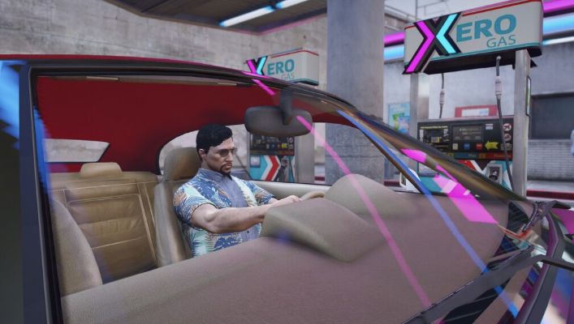
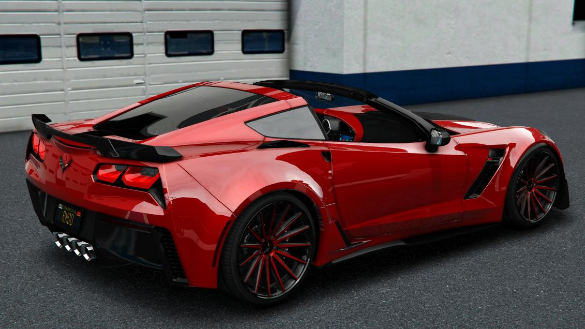

# Vehicles Guide

*Your ride defines you. Choose wisely.*

---

## Getting Your First Set of Wheels

Nothing says "I've made it" like your first car. Sure, you could take the bus. Walk. Beg for rides. But eventually, you need **your own wheels**.

> **The Moment:**
> *You hand over the cash. The salesman grins. The keys drop into your palm. You slide into the driver's seat, inhale that new car smell (or in your case, slightly used car smell), and turn the ignition. The engine rumbles. You pull out of the lot. This is freedom.*

---

## Dealerships

*PDM - Where automotive dreams become reality*

### Where to Buy

| Dealership | Specialty | Price Range | Location |
|------------|-----------|-------------|----------|
| **Premium Deluxe Motorsport** | General/Luxury | $$-$$$$ | Pillbox Hill |
| **Simeon's** | Budget/Used | $-$$ | La Mesa |
| **Boat Dealership** | Watercraft | $$-$$$ | Vespucci |
| **Air Dealership** | Aircraft | $$$$+ | LSIA |
| **Motorcycle Dealer** | Bikes | $-$$$ | Various |

### The Buying Process

1. **Browse the lot** - Walk around, check out the selection
2. **Interact with a vehicle** - Get specs and pricing
3. **Test drive** (if available) - Feel the power
4. **Purchase** - Cash or financing
5. **Drive away** - It's yours

> **RP Tip:** Don't just buy - negotiate! Player-owned dealerships often cut deals. Make it a conversation.

### Financing

Can't afford to pay cash? Finance it.

| Term | Details |
|------|---------|
| **Down Payment** | 10% of vehicle price |
| **Interest** | 10% total |
| **Payments** | 12 installments |
| **Frequency** | Every 24 hours |

> **Example:** $100,000 car = $10,000 down, then 12 payments of $8,250

**Warning:** Miss payments and they'll repossess your ride.

---

## Fuel System

*Running on empty hits different when you're 5 miles from the nearest station*

### Refueling

1. Pull up to a pump
2. Exit your vehicle
3. Interact with the pump
4. Select fuel amount
5. Pay and pump

### Pro Tips

| Tip | Why It Matters |
|-----|----------------|
| **Don't run empty** | Getting stranded sucks |
| **Jerry cans** | Emergency backup |
| **Electric vehicles** | Need charging stations |
| **Tank sizes vary** | Sports cars burn more |

> **Stranded:**
> *The engine sputters. Coughs. Dies. You coast to the shoulder, staring at the fuel gauge. Empty. In the middle of nowhere. No phone signal. It's getting dark. Maybe you should've stopped at that last station after all.*

---

## Garages & Storage

*A proper garage is a beautiful thing*

### Where Your Cars Live

| Garage Type | Access |
|-------------|--------|
| **House Garages** | Your property |
| **Public Parking** | City structures |
| **Job Garages** | Work vehicles |
| **Impound Lot** | When you mess up |

### Garage Menu

Press the interaction button at your garage to:
- View all owned vehicles
- Store your current vehicle
- Retrieve stored vehicles
- Check vehicle status
- Transfer to others

> **The Collection:**
> *You stand in your garage. Three cars. A motorcycle. That boat you impulse-bought. You remember when you had nothing - walking everywhere, begging for rides. Now look at you. Maybe that fourth car isn't so crazy after all...*

---

## Mechanics & Repairs

*When things go wrong - and they will - you need a good mechanic*

### Repair Shops

| Shop | Specialty | Best For |
|------|-----------|----------|
| **LS Customs** | General | Everyday fixes |
| **Auto Exotic** | Luxury | High-end vehicles |
| **Hayes Auto** | Budget | Cheap repairs |
| **Beeker's** | Classics | Vintage cars |
| **Benny's** | Custom | Lowriders, unique builds |

### What Mechanics Do

- **Engine repairs** - When it won't run right
- **Body work** - Buff out those scratches
- **Performance upgrades** - Make it faster
- **Visual modifications** - Make it yours
- **Tire changes** - Flats happen

### DIY Options

| Item | Use |
|------|-----|
| **Repair Kit** | Minor damage |
| **Tire Repair Kit** | Fix flats |
| **Cleaning Products** | Cosmetic care |

> **The Regular:**
> *"Same thing as last time?" the mechanic asks. You nod, embarrassed. Third time this month. "You know," she says, wiping her hands, "maybe try hitting fewer things?" Fair point.*

---

## Modifications

*Show off your build at the meets*

### Performance Upgrades

| Upgrade | Effect |
|---------|--------|
| **Engine** | More power |
| **Transmission** | Faster shifts |
| **Brakes** | Shorter stops |
| **Suspension** | Better handling |
| **Turbo** | Boost power |

### Visual Customization

| Mod | Options |
|-----|---------|
| **Paint** | Colors, pearls, metallics |
| **Wheels** | Styles, sizes |
| **Spoilers** | Wings, lips |
| **Body Kits** | Wide body, aero |
| **Window Tint** | Light to limo |
| **Lights** | Headlights, neon |

> **The Build:**
> *"What do you think?" Your friend circles the car. Studies the new wheels. The fresh paint. The lowered suspension. "It's... different." You grin. Different is exactly what you were going for.*

---

## Vehicle Controls

### Basic Driving

| Key | Action |
|-----|--------|
| `F` | Enter/Exit |
| `W/S` | Accelerate/Brake |
| `A/D` | Steer |
| `Space` | Handbrake |
| `H` | Headlights |
| `G` | Seatbelt |

### Turn Signals & Safety

| Key | Action |
|-----|--------|
| `Q` | Left indicator |
| `E` | Right indicator |
| `L` | Lock/Unlock |
| `X` | Roll down window |

### Advanced Controls (Vehicle Menu)

Press `K` or `/vehcontrol` for:
- Engine toggle
- All doors/windows
- Vehicle extras (lightbars, racks)
- Liveries
- Neon underglow
- Seat switching

---

## Keys & Security

### Your Keys

- Automatically receive keys to owned vehicles
- Keys are synced server-side
- Lock your car when you leave (press `L`)

### Giving Keys

Share access with others:
1. Use give keys command
2. Select the player
3. They can now unlock and start your vehicle

> **Trust Issues:**
> *"You sure about this?" Your buddy asks, holding your keys. You hesitate. That's your baby. Your pride and joy. But you need someone to move it while you're gone. "Just... be careful." He grins. "Always." You're definitely going to regret this.*

### Vehicle Theft

**For the criminals:**

| Method | Difficulty |
|--------|------------|
| **Lockpicking** | Varies by car class |
| **Hotwiring** | Skill check required |
| **Robbing NPCs** | Hold at gunpoint |

**Protecting yourself:**
- Always lock when leaving
- Park in safe areas
- Use garages for valuable cars
- Don't leave it running

---

## Insurance & Impound

### Insurance

- All purchased vehicles include basic insurance
- If destroyed, claim at mechanic/insurance office
- Deductible may apply

### Impound

Got towed? Your vehicle's at impound.

1. Visit the impound lot
2. Pay the impound fee
3. Retrieve your vehicle

**Warning:** Vehicles left too long may be auctioned.

> **The Walk of Shame:**
> *The impound lot. Again. The clerk doesn't even look up. "Plate number?" You mumble it. "$500." You pay, take the slip, find your car. The parking ticket is still on the windshield. Lesson learned. Probably.*

---

## Vehicle Classes

| Class | Examples | Price Range |
|-------|----------|-------------|
| **Compacts** | Blista, Issi | $5K - $20K |
| **Sedans** | Stanier, Fugitive | $15K - $50K |
| **Sports** | Jester, Elegy | $50K - $200K |
| **Super** | Zentorno, T20 | $200K+ |
| **SUVs** | Baller, Granger | $30K - $100K |
| **Motorcycles** | Bati, Akuma | $10K - $50K |
| **Boats** | Speeder, Jetmax | $50K - $200K |
| **Aircraft** | Various | $200K+ |

---

## Tips for Car Owners

### Starting Out

1. **Buy cheap first** - Learn to drive before you wreck expensive stuff
2. **Lock your doors** - Seriously, always
3. **Bank your money** - Don't flex cash, buy assets

### Building Up

1. **Maintain regularly** - Cheaper than major repairs
2. **Insure everything** - Protect your investments
3. **Know your mechanic** - Good ones save money

### Showing Off

1. **Car meets** - Show your build
2. **Racing** - Test your skills
3. **Cruising** - Just enjoy the drive

> **The Cruise:**
> *Windows down. Music up. The city lights blur past. No destination. No rush. Just you, the road, and the night. This is why you worked so hard. This moment. Right here.*

---

*Start with one. End with a collection. The journey is the fun part.*

---

**Now get out there and drive.**
